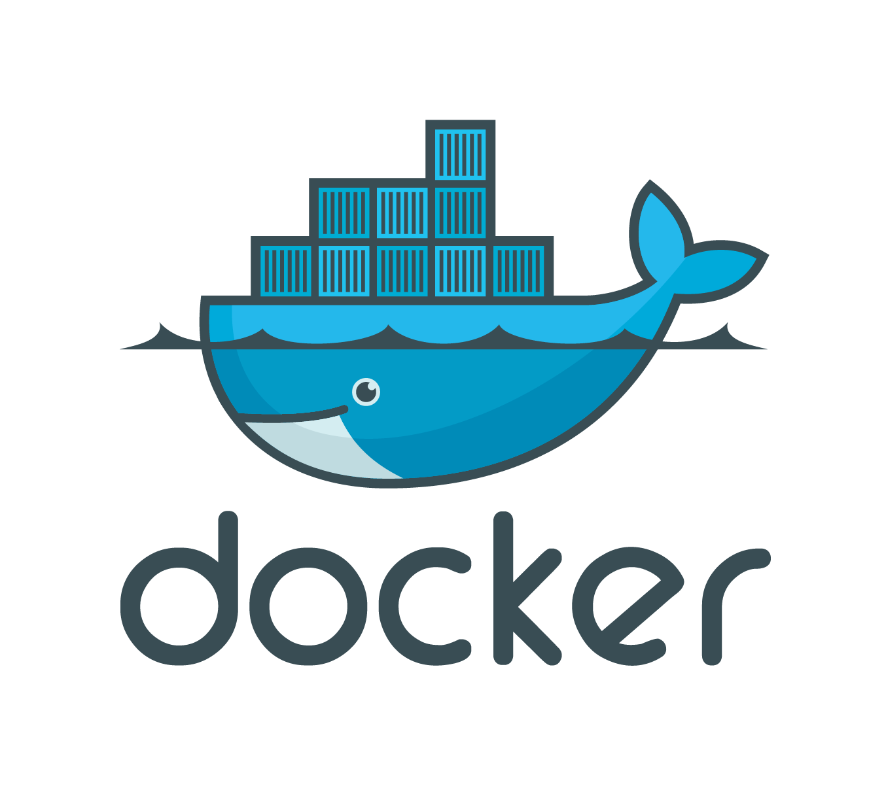
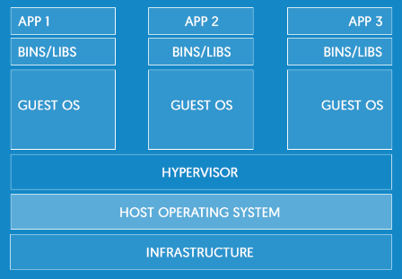
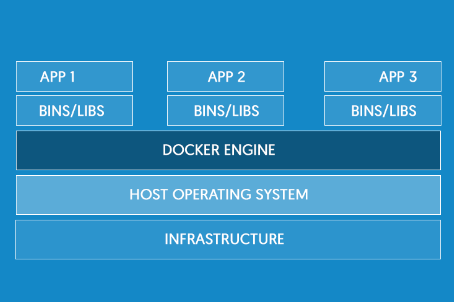
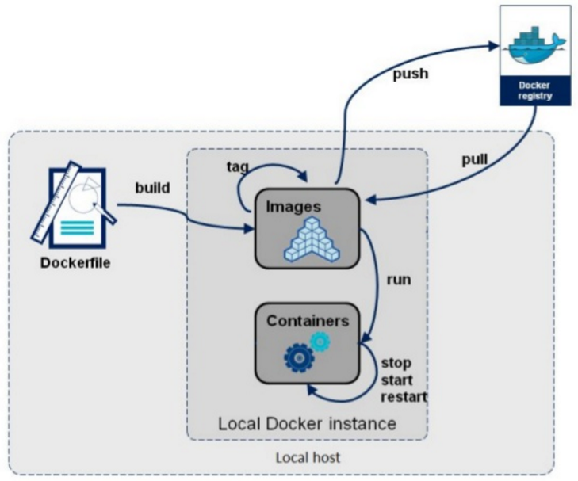
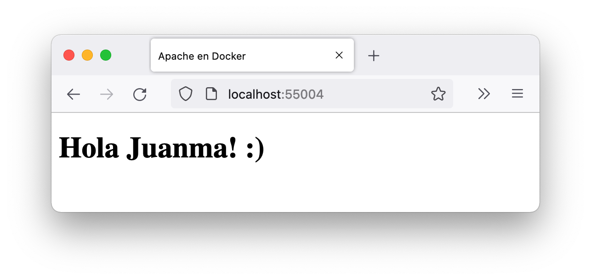
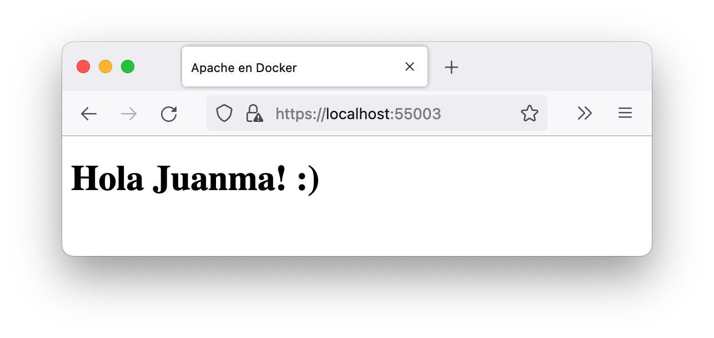
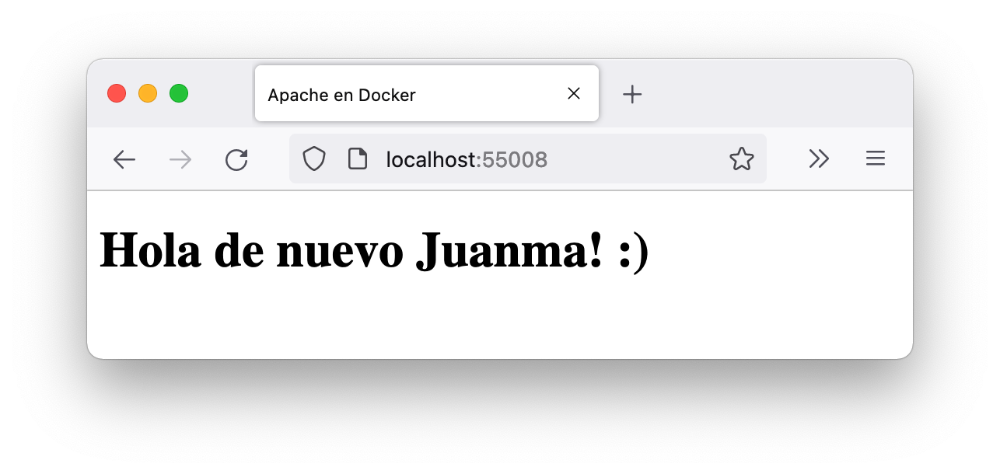

# DOCKER



<style>
emph {
  color: #E87B00;
}
</style>

## ¿Qué es Docker?

### Algunas definiciones:

1. Un entorno chroot (jaula de dependencias)
2. Contrato entre _sysadmin_  y  desarrollador
3. Empaquetador de aplicaciones
4. Un sistema de virtualización

## ¿Qué es Docker?

### 1. Un entorno chroot

Entorno aislado del sistema, donde se pueden instalar aplicaciones y librerías sin que afecte al sistema principal.

### 2. Contrato entre sysadmin y desarrollador

El  administrador solo debe  __desplegar__  los contenedores, mientras que el  desarrollador puede trabajar e instalar con ellos sin poner en riesgo el sistema.

### 3. Empaquetador de aplicaciones

Se puede crear un  _container_ para la aplicación, de modo que se ejecuten igual en distintas máquinas.

## ¿Qué es Docker?

### 4. Un sistema de virtualización

__Virtual machine__: _Include the application, the necessary binaries and libraries, and an entire guest operating system –– all of which can amount to tens of GBs._



## Virtualización

__Container__: _Include the application and all of its dependencies –– but share the kernel with other containers, running as isolated processes in user space on the host operating system. Docker containers are not tied to any specific infrastructure: they run on any computer, on any infrastructure, and in any cloud._



## Virtualización de Docker

- Docker no solo virtualiza el hardware, también el sistema operativo.

- Docker es una tecnología de _código abierto_ para crear, ejecutar, probar e implementar aplicaciones distribuidas dentro de __contenedores__ de software

- Docker está basado en el sistema de virtualización de __Linux__

## Contenedores Docker

### ¿Qué es un contenedor?

- Los contenedores crean un __entorno virtual__ para las aplicaciones
- Ocupan  menos __espacio__  que una máquina virtual al no tener que almacenar el sistema completo.
- El tiempo de __arranque__ de un container  es inferior a 1 segundo.
- Para __integrar__ máquinas virtuales en un host, debemos establecer la red. En los contenedores de Docker la integración es directa.

### Ventajas para desarrolladores

- __Dependencias__: Docker permite a los desarrolladores entregar servicios aislados, gracias a la eliminación de problemas de dependencias de ejecución del software.
- __Productividad__: Se  reduce el tiempo empleado en configurar los entornos o solucionar problemas relacionados con los mismos.
- __Despliegue__: Las aplicaciones compatibles con Docker se pueden desplegar desde equipos de desarrollo a versiones de producción.

## Instalación de Docker

- Trabajaremos con Ubuntu, aunque es posible en cualquier sistema operativo
- Docker solo trabaja con sistemas de 64 bits

### Instalación (Ubuntu)

Instrucciones de instalación:

<https://docs.docker.com/engine/install/ubuntu/>

Comprobar que se está ejecutando:

```bash
sudo docker --version
sudo service docker status
```

### Instalación (Windows)

- Docker está ya integrado en Windows 10, haciendo uso de Hyper-V
- Cuando se usa Docker no se puede utilizar __Virtual Box__, lo que puede significar un problema
- Tenemos la opción de deshabilitar Hyper-V. Para ello debemos ejecutar como administrador:

Apagar

```bash
bcdedit /set  hypervisorlaunchtype off
```

Encender

```bash
bcdedit /set hypervisorlaunchtype auto
```

## Usos sin necesidad de _sudo_ (opcional)

Para ejecutar el daemon de Docker y los contenedores sin ser superusuarios:

<https://docs.docker.com/engine/security/rootless/>

Creamos un grupo docker

`sudo groupadd docker`

Añadimos el usuario al grupo

`sudo usermod -aG docker $USER`

Cerramos sesión y volvemos a entrar

Comprobamos que se está ejecutando

`sudo service docker status`

## Comprobar la instalación

Vemos con qué versión estamos trabajando

`docker --version`

Lista de comandos

`docker`

Información del sistema

`docker info`

Descarga y ejecución de un contenedor básico

`docker run hello-world`

## Docker Hub

<https://hub.docker.com/>

Es un repositorio donde los usuarios de Docker pueden compartir las imágenes de los contenedores que han creado.

Existe una opción de pago para registro privado.

Tiene servicios automatizados [webhooks](https://docs.docker.com/docker-hub/webhooks/) y se puede integrar con Github y BitBucket.

Darse de alta como usuario

[https://hub.docker.com/](https://hub.docker.com/)

Iniciar sesión desde el terminal

`docker login`

Ver los repositorios locales descargados

`docker images`
> Tendremos el hello-world que hemos utilizado para comprobar que el servicio funcionaba

## Descargando de repositorios

Buscar un repositorio

`docker search ubuntu`

Descargar la versión oficial

`docker pull ubuntu`

> Podemos usar opciones como `ubuntu:14.04`, `ubuntu:latest`, etc.

Ejecutamos el contenedor

`docker run ubuntu /bin/echo "Pues parece que funciona"`

 > Al ejecutar `run`, si la imagen no existiera en el repositorio local, se descarga antes

## Repositorios en ejecución

Ver los contenedores en ejecución

`docker ps`

> `CONTAINER ID` es el identificador del contenedor
> `IMAGE` es la imagen usada para crearlo
> `NAME` -- si no se especifica, Docker crea un nombre aleatorio

Ver los contenedores que se han creado

`docker ps -a`

Ver el último repositorio creado

`docker ps -l`

Borrar una imagen

`docker rmi [nombre_imagen]`

## Trabajando en los contenedores

Poner nombre a un contenedor

`docker run -t -i --name myUbuntu ubuntu /bin/bash`

 `-t` incluye terminal dentro del contenedor
 `-i` se puede trabajar de manera interactiva

Para salir del terminal

`exit`

## Trabajando en los contenedores en ejecución

Poner nombre a un contenedor

```bash
docker run --name myUbuntu ubuntu /bin/bash \
    -c "while true; do echo hola mundo; sleep 1; done"
```

Vemos los contenedores que se están ejecutando

`docker ps`

Detenemos el contenedor

`docker stop [nombre contenedor]`

Borrar un contenedor

`docker rm [nombre_contenedor]`

## Trabajando en los contenedores ejecutando en segundo plano

Poner nombre a un contenedor

```bash
docker run -d --name myUbuntu ubuntu /bin/bash \
    -c "while true; do echo hola mundo; sleep 1; done"
```

 > __-d__ significa que se trabaje en segundo plano_

Vemos los contenedores que se están ejecutando: `docker ps`

Podemos ver la salida de nuestro contenedor: `docker logs myUbuntu`

Detenemos el contenedor

`docker stop [nombre contendedor]`

Abrir terminal de un determinado contenedor

`docker exec -it myUbuntu /bin/bash`

## Trabajando con Docker



## Opciones

Exportar un contenedor

`docker export myUbuntu > myUbuntu.tar`

Importar desde un fichero local

`docker import /path/to/latest.tar`

## Ejemplo: contenedor con aplicación web en Python

Descargamos la imagen

`docker run -d -P training/webapp python app.py`

> __-d__ trabajar en segundo plano
> __-P__ mapea los puertos a nuestro host para poder ver la aplicación

Ejecuta con `python` la aplicación web de servidor `app.py`, contenida en la imagen `training/webapp`

Vemos los puertos usados: `docker ps -a`

> La opción __-P__ redirecciona los puertos del contenedor de la imagen (en este caso el 5000) a un puerto de nuestro host local: `[0.0.0.0:55000->5000/tcp]`

Abrir en el navegador <http://localhost:55000/>

### Otras opciones de ejecución

Especificando un puerto en el host

`docker run --name myWeb -d -p 80:5000 training/webapp python app.py`

> __-p__ mapea el puerto 80 del host local al 5000 del contenedor

Abrir en el navegador <http://localhost>

Podemos ver los puertos asociados a nuestro contenedor

`docker port [nombre contenedor] puerto`

`docker port myWeb 5000`

Podemos ver los logs de nuestra aplicación

`docker logs -f myWeb`
> __-f__ muestra los logs de manera continua

Ver procesos que se están ejecutando en el contenedor

`docker top myWeb`

Inspeccionar la máquina

`docker inspect myWeb`

Detener el contenedor

`docker stop myWeb`

Reiniciar un contenedor

`docker start myWeb`

## Creando nuestros contenedores

- Creación __desde imagen__: Partimos de una imagen de un contenedor para realizar modificaciones y crear el nuestro

- Creación desde cero: Partimos de un __fichero de configuración__ para crear una imagen para un contenedor

### Creación desde una imagen

Ejecutar el contenedor `myWeb`

`docker run --name myWeb -t -i  -d -p 80:5000 training/webapp python app.py`

Abrir un terminal del contenedor

`docker exec -t -i myWeb /bin/bash`

Instalar nano, editar `app.py` y hacer commit

```bash
docker commit -m "Modificando saludo" -a "Mi Nombre" ac1c3a5c70ad \
    usuario/myweb:v2
```

> - Especificar el id del contenedor en ejecución a modificar
> - `usuario`  debe coincidir con nuestro usuario de Docker Hub
> - El nombre de la imagen `myweb` debe ir en minúsculas

Vemos nuestra nueva imagen

`docker images`

Ejecutar nuestra imagen

```bash
docker run --name myWeb2 -t -i  -d -p 80:5000 \
    usuario/myweb:v2 python app.py
```

### Creación de un _Dockerfile_

<https://docs.docker.com/engine/userguide/eng-image/dockerfile_best-practices/>

## Comandos básicos de Dockerfile

__FROM:__   para definir la imagen base
__MAINTAINER:__    nombre o correo del mantenedor
__COPY:__   copiar un fichero o directorio a la imagen
__ADD:__   para copiar ficheros desde urls
__RUN:__   ejecutar un comando dentro del container
__CMD:__   comando por defecto cuando ejecutamos un container
__ENV:__   variables de entorno
__EXPOSE:__   para definir los puertos del contenedor
__VOLUME:__   para definir directorios de datos que quedan fuera de la imagen
__ENTRYPOINT:__   comando a ejecutar de forma obligatoria al correr una imagen
__USER:__   Usuario para RUN, CMD y ENTRYPOINT
__WORKDIR:__   directorio para ejecutar los comandos

## Ejemplo de Dockerfile

Creamos un directorio: `mkdir myapacheweb && cd myapacheweb`

Creamos un fichero llamado Dockerfile: `touch Dockerfile`

Editamos el fichero con el siguiente contenido:

```docker
FROM ubuntu:14.04 
RUN apt-get update && \
  apt-get install -y apache2 && \
  apt-get clean && \
  rm -rf /var/lib/apt/lists/* 
RUN echo "<h1>Apache with Docker</h1>" > /var/www/html/index.html 
ENV APACHE_RUN_USER www-data 
ENV APACHE_RUN_GROUP www-data 
ENV APACHE_LOG_DIR /var/log/apache2 
EXPOSE 80 
ENTRYPOINT apache2ctl -D FOREGROUND 
```

Construcción de nuestra imagen

`docker build -t usuario/myserver .`

Ejecutamos nuestra imagen

`docker run -i -t -p 3333:80 --name myserver usuario/myserver:latest`

Probar el contenedor y abrir <http://localhost:3333/>

Colocamos nuestra imagen en Docker Hub

`docker push usuario/myserver`

Averiguar el tamaño de las imágenes

`docker history usuario/myserver`

### Imagen de Ubuntu

La imagen de ubuntu no trae muchas de las herramientas necesarias para comprobar el funcionamiento del contenedor. Se recomienda instalar las siguientes herramientas.

```bash
apt-get update
apt-get install nano
apt-get install -y net-tools
apt-get install telnet
apt-get install iputils-ping
apt-get install curl
```

## Tutorial de Docker

[https://docs.docker.com/get-started/](https://docs.docker.com/get-started/)

## Ejercicio: Apache server

Tareas:

1. Crear un contenedor con Apache Server 2 (buscar en Docker Hub)
2. Personalizar el contenedor. El servidor por defecto muestra en la página principal "It works!". Modificar este mensaje para que muestre un saludo personal: "Hello + (tu nombre y apellidos)!".
3. Configurarlo para que por defecto utilice el puerto 8082.
4. Subir la imagen del contenedor creado a Docker Hub. La imagen debe llamarse `apacheserver_p1`.

Construir una imagen nueva

```bash
mkdir mi-apache
nano index.html
mv index.html mi-apache
nano Dockerfile
```

Dockerfile:

```docker
FROM bitnami/apache
COPY index.html /opt/bitnami/apache/htdocs/index.html
```

```bash
docker build -t usuario/mi-apache .
docker run -d -P --name=mi-apache-1 usuario/mi-apache
```

Subir nueva imagen a Docker Hub:

`docker push usuario/mi-apache`

## Directorios enlazados y volúmenes

Para compartir información con Docker cuando necesitamos:

- Compartir un __directorio__ entre múltiple contenedores.
- Compartir __un directorio__ entre el host y un contenedor.
- Compartir __un fichero__ entre el host y un contenedor.

Opciones:

- __Directorios enlazados__ *(bind):* la información se guarda fuera de Docker en el host local. Esta opción es mejor para datos no generados por los contenedores.
- __Volúmenes__: la información se guarda usando Docker. Mejor para datos generados por los propios contenedores.

## Directorios enlazados (bind)

Características:

- Permiten  __persistencia__  de la información del contenedor.
- Se montan en un  __path específico de la máquina local__  (fuera de Docker).
- Permiten  __borrar los contenedores sin perder la información__ .

### Ejemplo con directorios enlazados (bind) (1)

Crear directorio local `p02` para compartir:

`mkdir /Users/Usuario/p02`

Ejecutar el contenedor:

```bash
docker run -d -P --name=apache-bind-1 \
  --mount type=bind,source=`pwd`/p02,target=/app bitnami/apache
```

Comprobar los puertos a los que se ha asignado el 8080 (http) y 8443 (https) del Servidor Apache configurado en el contenedor:

```bash
$ docker ps -a
CONTAINER ID   IMAGE           COMMAND                 CREATED        STATUS         PORTS                                              NAMES
...
bcaae8157e45   bitnami/apache  "/opt/bitnami/script…"  3 minutes ago  Up 3 minutes   0.0.0.0:55004->8080/tcp, 0.0.0.0:55003->8443/tcp   apache-bind-1
...
```

Editar el fichero con _nano_ (u otro editor)

`nano /Users/Usuario/p02/index.html`

```html
<!DOCTYPE html>
<html lang="es">
<head>
  <meta charset="utf-8">
  <title>Apache en Docker</title>
  <meta name="viewport" content="width=device-width, initial-scale=1.0">
</head>
<body>
  <h1>Hola Usuario! :)</h1>
</body>
</html>
```

Abrir en el host las URL <http://localhost:55004/> y <https://localhost:55003/>
(para ver los cambios podría ser necesario reiniciar Apache, aunque también podemos reiniciar el contenedor con `docker restart apache-bind-1`)

 

Si eliminamos el contenedor, no perdemos el contenido de la web:

```bash
docker stop apache-bind-1
docker rm apache-bind-1
docker run -d -P --name=apache-bind-2 \
  --mount type=bind,source=`pwd`/p02,target=/app bitnami/apache
```

## Volúmenes

### Características

- Permiten persistencia de información del contenedor
- Se montan en un _path_ específico del contenedor
- El acceso a la información sólo puede realizarse a través de Docker

### Ejemplo con volúmenes (1)

Creando un volumen para la web

```bash
docker run -d -P --name=apache-volume-1 \
   --mount type=volume,source=vol-apache,target=/app bitnami/apache
```

Comprobar el puerto asignado con `docker ps -a`

Acceso al volumen

`docker volume ls`

`docker exec -it apache-volume-1 /bin/bash`

Comprobar que `/app` está vacía y salir con `exit`

Actualizamos el contenido del volumen

`nano index.html`

`docker cp index.html apache-volume-1:app/`

Acceso de nuevo al volumen y comprobar que está el archivo `index.html`

`docker exec -it apache-volume-1 /bin/bash`

Acceso al contenido de la web



Compartir volumen con otro contenedor

```bash
docker run -d -P --name=apache-volume-2 \
   --mount type=volume,source=vol-apache,target=/app bitnami/apache
```

Borrando volumen

```bash
docker stop apache-volume-2
docker rm apache-volume-2
```

`docker volume rm vol-apache`

```text
Error response from daemon: remove vol-apache: volume is in use - [4a4794f86...3c8]
```

Reintentar borrado:

```bash
docker stop apache-volume-1
docker rm apache-volume-1
docker rm apache-volume-2
docker volume rm vol-apache
```

Comprobar que se ha borrado con `docker volume ls`

## Configuraciones de red

- Permiten comunicación entre todos los contenedores pertenecientes a una red a través del nombre del contenedor
- Permiten aislamiento con respecto a otros contenedores
- Un contenedor puede pertenecer a varias redes

### Tipos de redes

Ver las redes existentes: `docker network ls`

```bash
$ docker network ls
NETWORK ID     NAME      DRIVER    SCOPE
21c353b4b7a5   bridge    bridge    local
7a7abec15748   host      host      local
40157ecf9fcf   none      null      local
```

- __host__ representa la red del propio equipo y haría referencia a `eth0`
- __bridge__ representa la red `docker0` y a ella se conectan todos los contenedores por defecto
- __none__ significa que el contenedor no se incluye en ninguna red. Si verificamos esto con el comando `ifconfig` dentro del contenedor, veríamos que sólo tiene la interfaz de loopback `lo`

Saber qué contenedores usan un tipo de red: `docker network inspect bridge`

### Ejemplo de configuración de red (1)

WordPress empaquetado en un contenedor:

<https://github.com/bitnami/charts/tree/main/bitnami/wordpress>

Crear una nueva red:

`docker network create wordpress-network`

Crear primer volumen para persistencia de MariaDB:

`docker volume create --name mariadb_data`

Crear segundo volumen para persistencia de WordPress:

`docker volume create --name wordpress_data`

Crear primer contenedor que usa la red (base de datos `mariadb`):

```bash
docker run -d --name mariadb --env ALLOW_EMPTY_PASSWORD=yes \
  --env MARIADB_USER=bn_wordpress \
  --env MARIADB_DATABASE=bitnami_wordpress \
  --network wordpress-network \
  --volume mariadb_data:/bitnami/mariadb \
  bitnami/mariadb:latest
```

Crear segundo contenedor que usa la red (servidor `wordpress`):

```bash
docker run -d --name wordpress -p 8080:8080 -p 8443:8443 \
  --env ALLOW_EMPTY_PASSWORD=yes \
  --env WORDPRESS_DATABASE_USER=bn_wordpress \
  --env WORDPRESS_DATABASE_NAME=bitnami_wordpress \
  --network wordpress-network \
  --volume wordpress_data:/bitnami/wordpress \
  bitnami/wordpress:latest
```


## Ejercicio: Nginx con red y volumen compartido

Realizar los siguientes ejercicios para trabajar los conceptos vistos durante la práctica.

### Parte 1

1. Crear volumen compartido `volumenDocker`
2. Crear un contenedor de Nginx que use el volumen `volumenDocker`.
3. Modifique el contenido del fichero `index.html` incluyendo un saludo personal en lugar del texto por defecto.
4. Cree un segundo contenedor que también use el volumen `volumenDocker`.
5. Compruebe que puede acceder a `localhost:80` (primer contenedor) y `localhost:81` (segundo contenedor) y ver el contenido de `index.html`.

### Parte 2

1. Crear una nueva red `redDocker`.
2. Crear un contenedor de Ubuntu `Ubuntu1`.
3. Crear un contenedor de Ubuntu `Ubuntu2`.
4. Conectar `Ubuntu1` a la red `redDocker`.
5. Intentar hacer ping a `Ubuntu1` desde `Ubuntu2`. ¿Funciona? ¿Por qué?.
6. Conectar `Ubuntu2` a la red `redDocker`.
7. Intentar de nuevo hacer ping a `Ubuntu1` desde `Ubuntu2`. ¿Funciona? ¿Por qué?

## Ejercicios con contenedores

Todos los contenedores tienen un __ID__. Además, docker da un __nombre__ aleatorio a los contenedores si no lo elegimos nosotros.

```console
$ docker ps -a
CONTAINER ID   IMAGE                    COMMAND                  CREATED         STATUS                      PORTS     NAMES
c8bb700e5f39   hello-world              "/hello"                 5 seconds ago   Exited (0) 4 seconds ago              busy_haibt
efe18fd91e7b   dodero/myserver:latest   "/bin/sh -c 'apache2…"   20 hours ago    Exited (130) 20 hours ago             myserver
```

Borrar contenedores:

  `docker rm busy_haibt` borra el contenedor con nombre `busy_haibt`

  `docker rm c8b` borra el contenedor con ID `c8bb700e5f39` (no hace falta el ID completo)

Elegir el nombre del contenedor (debe ser único en local):

  `docker run --name=hola hello-world`

Crear un contenedor asignando un puerto aleatorio en local:

  `docker run -d -P --name=apache-server bitnami/apache`

  `docker ps -a` (para ver puerto asignado)

Ejecutar terminal en el contenedor creado:

  `docker exec -it apache-server /bin/bash`

Construir una imagen nueva:

```bash
mkdir mi-apache
nano index.html
mv index.html mi-apache
nano Dockerfile
```

Dockerfile:

 ```dockerfile
FROM bitnami/apache
COPY index.html /opt/bitnami/apache/htdocs/index.html
```

```bash
docker build -t usuario/mi-apache .
docker run -d -P --name=mi-apache-1 usuario/mi-apache
```

Subir nueva imagen a Docker Hub:

`docker push usuario/mi-apache`

Contenedor que usa directorio enlazado (bind):

```bash
docker run -d -P --name=apache-bind-1 \
   --mount type=bind,source=/Users/Usuario/directorio-compartido,target=/app bitnami/apache
```

Contenedor que usa volumen:

```bash
docker run -d -P --name=apache-volume-1 \
   --mount type=volume,source=vol-apache,target=/app bitnami/apache
```

Borrando volumen (se deben borrar también los contenedores que lo usen):

`docker rm apache-volume-1`

Crear una nueva red `opencart-network`:

`docker network create opencart-network`

Contenedor que usa una red específica:

```bash
docker run -d --name=mariadb \ 
  -e ALLOW_EMPTY_PASSWORD=yes \
  -e MARIADB_USER=bn_opencart \
  -e MARIADB_DATABASE=bitnami_opencart \
  --net=opencart-network bitnami/mariadb
```

Conectar un contenedor a una red:

`docker network connect opencart-network mariadb`

## Docker compose

Configurar múltiples contenedores como servicios cuando necesitamos:

- Arquitectura que involucra más de un componente/servicio funcionando al mismo tiempo
- Pre-configurar para que estos contenedores trabajen juntos

### Características

- Permite desplegar los contenedores en un único host (limitación).
- En el caso de que se quiera desplegar en un cluster hay que utilizar [Docker Swarm](https://www.ionos.es/digitalguide/servidores/know-how/docker-compose-y-swarm-gestion-multicontenedor/)

Nosotros solo trabajaremos con Docker Compose...

## Fichero `docker-compose.yml`

Secciones principales del fichero Docker Compose que vamos a utilizar:

- __Version__: especifica la versión del fichero Docker Compose, si no se establece por defecto es la 1.
- __Services__: especifica los servicios de su aplicación, es decir, los contenedores que van a ejecutarse.
- __Networks__: especifica la configuración de red que van a utilizar los servicios.
- __Volumes__: especifica los volúmenes que van a utilizar los servicios para guardar/leer la información.

### Ejemplo inicial con Docker compose

Vamos a desplegar una aplicación web hecha con Python/Flask que devuelva en JSON el nombre del usuario

Paso 1. Creamos una carpeta donde añadir los siguientes ficheros:

- `requirements.txt`
- `app.py`
- `Dockerfile`
- `docker-compose.yml`

  ```bash
  mkdir docker-compose-ejemplo1
  ```

Paso 2. Creamos el fichero “requirements.txt”

  ```text
  Flask
  Redis<3.0.0
  ```

Paso 3. Creamos el código de la aplicación Python `app.py`:

```python
from flask import Flask, request, jsonify
from redis import Redis
app = Flask(__name__)
redis = Redis(host="redis", db=0, socket_timeout=5, charset="utf-8", decode_responses=True)
@app.route('/', methods=['POST', 'GET'])
def index():
    if request.method == 'POST':
        name = request.json['name']
        redis.rpush('students', {'name': name})
        return jsonify({'name': name})
    if request.method == 'GET':
        return jsonify(redis.lrange('students', 0, -1))
```

Paso 4. Creamos el fichero `Dockerfile`

```dockerfile
FROM python:3.7.0-alpine3.8
WORKDIR /usr/src/app
COPY requirements.txt ./
RUN pip install --no-cache-dir -r requirements.txt
COPY . .
ENV FLASK_APP=app.py
CMD flask run --host=0.0.0.0
```

Paso 5. Creamos el fichero `docker-compose.yml`

```yml
version: '3'
services:
  app:
    build: .
    image: dodero/flask-redis:1.0
    environment:
      - FLASK_ENV=development
    ports:
      - 5000:5000
  redis:
    image: redis:4.0.11-alpine
```

Ficheros necesarios en la carpeta:

```console
$ ls -l docker-compose-ejemplo1/
total 32
-rw-r--r--  1 dodero  staff  184 11 mar 09:19 Dockerfile
-rw-r--r--  1 dodero  staff  481 11 mar 09:19 app.py
-rw-r--r--  1 dodero  staff  196 11 mar 09:19 docker-compose.yml
-rw-r--r--  1 dodero  staff   17 11 mar 09:15 requirements.txt
```

Cambiarse a la carpeta: `cd ~/docker-compose-ejemplo1`

Ejecutar Docker Compose:

`docker-compose up`  (añadir `-d` para ejecutar en background)

__NOTA__: docker-compose está instalado en Windows y MacOS por defecto. En linux hay que instalarlo manualmente.

Con lo anterior hemos arrancado un contenedor (servicio) `app` con la aplicación en Python y otro contenedor (servicio) `redis` con una base de datos _redis_.

```console
$ docker ps
CONTAINER ID   IMAGE                    COMMAND                  CREATED         STATUS         PORTS                    NAMES
ff4292697a4c   dodero/flask-redis:1.0   "/bin/sh -c 'flask r…"   5 minutes ago   Up 5 minutes   0.0.0.0:5000->5000/tcp   docker-compose-ejemplo1-app-1
dc5a0762ce04   redis:4.0.11-alpine      "docker-entrypoint.s…"   5 minutes ago   Up 5 minutes   6379/tcp                 docker-compose-ejemplo1-redis-1
```

Probando el ejemplo (añadiendo nuevo estudiante):

```console
$ curl --header "Content-Type: application/json" \
   --request POST \
   --data '{"name":"Usuario"}' \
   localhost:5000
```

Probando el ejemplo (obteniendo los estudiantes creados): Acceder a `localhost:5000` en el navegador o ejecutando `curl localhost:5000`

```json
[
    "{'name': 'Usuario'}"
]
```

## Gestionando aplicaciones con múltiples contenedores

Parar el servicio

`docker-compose down`

Visualizar la configuración de la red creada

`docker network ls`

`docker network inspect docker-compose-ejemplo1_default`

Procesos que están ejecutándose:

`docker-compose ps`

`docker-compose top`

Ver los logs generados por estos procesos:

`docker-compose logs`

Ejecutar un comando en un contenedor iniciado:

`docker-compose exec app ps`

Subir las imágenes de los servicios a DockerHub:

`docker-compose push app`

`docker-compose push redis`

Actualizar las imágenes de los servicios:

`docker-compose pull app`

`docker-compose pull redis`

Actualización del fichero `docker-compose.yml`:

```yml
version: '3'
services:
  app:
    build: 
      context: .
      args:
        - IMAGE_VERSION=3.7.0-alpine3.8
    image: dodero/flask-redis:1.0
    environment:
      - FLASK_ENV=development
    ports:
      - 80:5000
  redis:
    image: redis:4.0.11-alpine
```

Ejecutamos `docker-compose up -d` y sólo se regenera lo necesario (docker-compose mantiene los estados)

### Escalar servicios

Se pueden arrancar varias instancias de un mismo servicio para así escalarlo

Escalar un servicio con Docker Compose:

`docker-compose up -d --scale app=3` Falla, ¿por qué?

```console
$ docker-compose up -d --scale app=3
[+] Running 2/4
 ⠿ Container docker-compose-ejemplo1-redis-1  Running                                                                 0.0s
 ⠿ Container docker-compose-ejemplo1-app-3    Running                                                                 0.0s
 ⠹ Container docker-compose-ejemplo1-app-1    Starting                                                                0.2s
 ⠹ Container docker-compose-ejemplo1-app-2    Starting                                                                0.2s
Error response from daemon: driver failed programming external connectivity on endpoint docker-compose-ejemplo1-app-2
(43f832ac334345e85b60a65851c9ac76d250e3498e0699469e066dddd8655ba6): Bind for 0.0.0.0:80 failed: port is already allocated
```

Actualizamos el fichero `docker-compose.yml` eliminando la redirección de puertos:

```yml
version: '3'
services:
    app:
      build:
        context: .
        args:
          - IMAGE_VERSION=3.7.0-alpine3.8
      image: dodero/flask-redis:1.0
      environment:
        - FLASK_ENV=development
      ports:
        - “80-83:5000”
    redis:
      image: redis:4.0.11-alpine
```

Intentamos escalar el servicio de nuevo (hay que usar una versión actualizada de docker-compose <https://stackoverflow.com/questions/49839028/how-to-upgrade-docker-compose-to-latest-version>)

Había un conflicto de puertos porque todas las réplicas querían usar el mismo.

Si persisten los conflictos de puertos, comprobar qué puertos están ocupados y cerrar todos los procesos que ocupen los puertos 80-83:

`sudo lsof -i -P | grep LISTEN`

Abrir en el navegador `localhost:80`, `localhost:81`, etc.

Probar a ejecutar el comando con distintos datos (`'{"name":"Ana"}'`, `'{"name":"Belén"}'`...) y distintos endpoints (`localhost:80`, `localhost:81`...). ¿Se comparten los valores almacenados en `redis`? ¿Y si lanzáramos varias instancias del contenedor `redis` con `docker-compose up -d --scale app=3 --scale redis=3`?

```bash
curl --header "Content-Type: application/json" \
   --request POST \
   --data '{"name":"Usuario"}' \
   localhost:80
```

## Usando volúmenes con Docker Compose

Usando memoria persistente en los contenedores

### Ejemplo de uso de volumen con Docker Compose

Configuramos el volumen en el archivo `docker-compose.yml`

```yml
version: '3'
services:
  app:
    build: .
    image: dodero/flask-redis:1.0
    environment:
      - FLASK_ENV=development
    ports:
      - 80:5000
  redis:
    image: redis:4.0.11-alpine
    volumes:
      - mydata:/data
volumes:
  mydata:
```

Ejecutamos docker-compose

`docker-compose down`

`docker-compose up -d`

Consultamos el volumen creado

`docker volume ls`

## Configuraciones de red con Docker Compose

Conceptos básicos de red con Docker Compose

### Ejemplo de configuración de red con Docker Compose

Configuramos la red en el archivo `docker-compose.yml`

```yml
version: '3'
services:
  app:
    build: .
    image: dodero/flask-redis:1.0
    environment:
      - FLASK_ENV=development
    ports:
      - 80:5000
    networks:
      - mynet
  redis:
    image: redis:4.0.11-alpine
    networks:
      - mynet
networks:
  mynet:
```

Ejecutamos docker-compose

`docker-compose down`

`docker-compose up -d`

Ver la configuración de la red creada

`docker network inspect docker-compose-ejemplo1_mynet`
