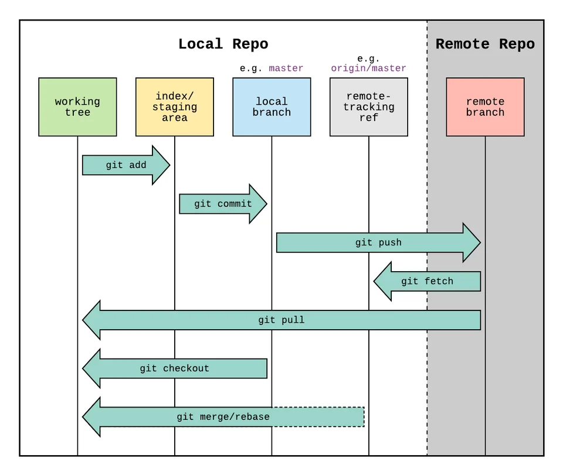
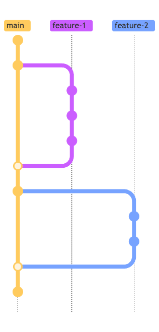
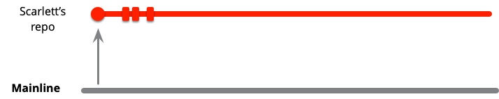
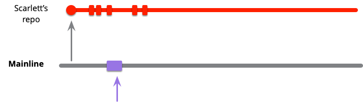
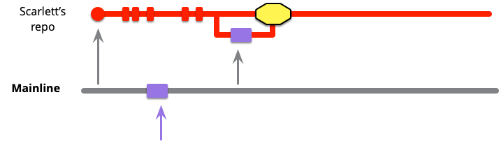
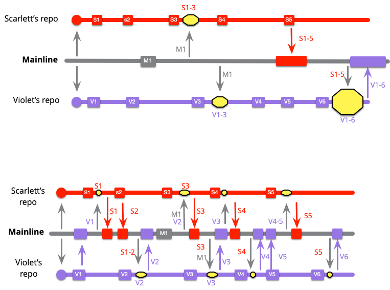
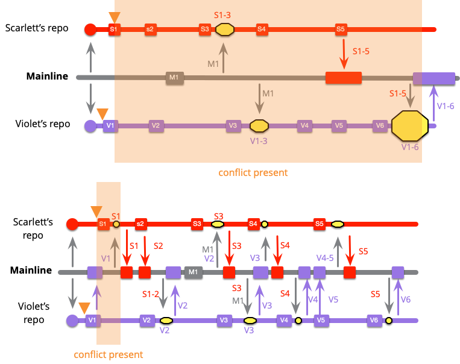
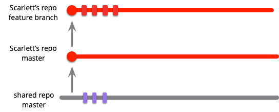
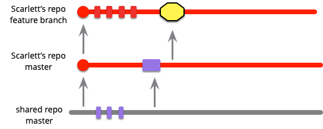

<!-- size: 16:9 -->
<!-- theme: default -->

<!-- paginate: skip -->

<!-- headingDivider: 0 -->

# BRANCHING PATTERNS

---

## SCV: Source Code Versioning

<emph>VCS: Version Control Systems</emph> &nbsp; &nbsp; &nbsp; &nbsp; &nbsp; &nbsp; <emph>SCM: Source Code Management</emph>

¿Para qué sirven?

- Rastrear cambios y restaurar versiones anteriores del software
- Gestionar y coordinar el código fuente en equipos de desarrollo de software
- Seguimiento de varias líneas de trabajo y ayudar a fusionar líneas

<!--

El código fuente es un activo vital para cualquier equipo de desarrollo de software. Las herramientas de gestión de código fuente sirven para rastrear cambios, lo que facilita la recreación de versiones anteriores del software y ver cómo se desarrolla con el tiempo.

También sirven para coordinar a un equipo de programadores que trabajan en un código base común. Al registrar los cambios que cada desarrollador realiza, estos sistemas pueden hacer un seguimiento de múltiples líneas de trabajo al mismo tiempo y ayudar a los desarrolladores a fusionar estas líneas de trabajo.

-->

---

### SCV centralizado o distribuido

---

<!-- _class: invert -->

<emph>¿Git es descentralidado o centralizado?</emph>

---

### ¿Git descentralizado?

Repo central con la <emph>verdad</emph>

- <emph>origin</emph> centraliza pull/push

¿Hacer pull de otros repos?

- Subequipos: Alice & Bob, Alice & David, David & Clair
- Alice define _remotes_ `bob` y `david`, etc.

---

### Git: repositorios remotos

| 📙 | Definiciones |
----:|:----
<emph>fork</emph> |  Una copia de un repositorio en el que se puede trabajar de forma independiente (te haces propietario)
<emph>clone</emph> | Copia de un repo remoto (<emph>origin</emph>) en la máquina local, para trabajar independientemente (pero no eres propietario)
<emph>origin</emph> | Nombre para referirse al repositorio remoto del que se clonó un repo local
<emph>upstream</emph> | Nombre para referirse al repositorio original desde el que se forkeó un repo

---

## Workflow y <emph>branching patterns</emph>

- Patrones para ayudar a manejar la división del desarrollo en líneas de trabajo que se dividen y fusionan (split/merge) en ramas (branch)
- No son estándares definitivos
- Dependen de la estructura social del equipo y sus prácticas habituales

<!--

Se han desarrollado varios patrones para ayudar a manejar la división del desarrollo en líneas de trabajo que se dividen y fusionan en el flujo de trabajo (workflow) de los equipos de desarrollo de software.

Estos patrones no son estándares definitivos. El flujo de trabajo del desarrollo de software depende en gran medida del contexto, especialmente de la estructura social del equipo y otras prácticas que el equipo siga.

-->

---

### Patrones de workflow habituales

- [GitHub flow](https://docs.github.com/es/get-started/quickstart/github-flow): para todo (no sólo desarrollo)
- [Git Flow](https://nvie.com/posts/a-successful-git-branching-model/): para desarrollo [web], centrado en _releases_
  - [Git Flow considered harmful](https://www.endoflineblog.com/gitflow-considered-harmful)
- [OneFlow](https://www.endoflineblog.com/oneflow-a-git-branching-model-and-workflow): ramas de vida corta
- [Gitlab flow](https://about.gitlab.com/topics/version-control/what-is-gitlab-flow/): menos _tagging_ y _merging_

---

## Conceptos de branching

<emph>source branching</emph> = crear una copia del código fuente para registrar en ella todos los cambios de forma independiente

- ¿Qué es un <emph>commit</emph>?
- ¿Qué es <emph>staging</emph>?
- ¿Qué es una <emph>rama</emph>?
- ¿Qué es un <emph>head</emph>?
- ¿Qué es un <emph>fork</emph>?

<!--
Git permite cambiar la historia a base de commits. Otros SCV no.

Git representa los commits como snapshots, no como diffs. Eso hace que sea más rápido, pero ocupa más espacio.

Staging es añadir ficheros al próximo commit.
-->

---

| 📙 | Definiciones |
----:|:----
<emph>commit</emph> | Conjunto de cambios en el código fuente que se registra en el repositorio
<emph>branch</emph> | Una secuencia de commits
<emph>head</emph> | Último commit de una rama
<emph>staging</emph> | Preparar los cambios para el próximo commit

¡Cuidado! Confusión terminológica sobre qué es una rama

- ¿Cuando se clona un repo, se crea una nueva rama?
- Distintos DVCS: Mercurial _branch_ $\neq$ Git _branch_ $\approx$ Mercurial _bookmark_

<!--
En Mercurial, cada rama requiere su propio directorio
En Git, cada rama es un puntero a un commit, todo dentro de un único directorio

En Mercurial, cambiar de rama es cambiar de directorio
En Git, cambiar de rama es cambiar el contenido del directorio (haciendo checkout)

Mercurial tiene named branches (permanentes) para ramas dentro de un mismo directorio
En Git las ramas son temporales y se borran cuando se fusionan
-->

---

| 📙 | Definiciones |
----:|:----
<emph>branching</emph> | Crear una copia del código fuente para registrar en ella todos los cambios en el código de forma independiente
<emph>merge</emph> | Integrar los cambios de una rama en otra
<emph>codeline</emph> | Secuencia particular de versiones de una base de código (_codebase_)
<emph>clone</emph> | Clonar un repo es hacer un _checkout_ de una rama en una nueva _codeline_
<emph>mainline</emph> | Una rama única compartida por todos que sirve como estado actual del producto

En cada commit, pasar pruebas automáticas para asegurar que la rama no tiene defectos

---

### Codeline

- Cada desarrollador tiene (en cuanto hace cambios locales) al menos una <emph>codeline personal</emph> en la _working copy_ de su equipo local
- En un DVCS como git...
  - ...cuando se clona un repo git, se hace un checkout de main y se actualiza algo, se obtiene una <emph>codeline nueva</emph>, aunque no se hagan commits
  - ...obtenemos ramas adicionales cada vez que clonamos un repositorio; las ramas pueden ser <emph>locales</emph> o <emph>remotas</emph>

---

<!-- _class: invert -->

### Merge vs rebase vs cherry-pick

---

### Tutorial recomendado

JJ Merelo: [Aprende Git](https://github.com/JJ/aprende-git)

---

## Patrones habituales de Workflow

---

### 1. Git Flow

Más estructurado y utiliza diferentes tipos de ramas para diversas etapas del desarrollo.
No es muy adecuado para hacer CD o CDEP.

1. La rama `develop` es la base para nuevas características.
2. Se crean ramas `feature` de características y se fusionan de nuevo en `develop`.
3. Se crean ramas `release` para preparar las versiones a entregar.
4. Una vez probadas, las ramas se fusionan en `master` y `develop`.
5. Las ramas `hotfix` corrigen problemas en producción y se fusionan en `master` y `develop`.
6. Cuando los cambios en `develop` son estables, se fusionan en `master` y se le asigna una _tag_ con el número de _release_.

Alex Hyett: [Comparativa GitHub flow vs GitFlow](https://www.alexhyett.com/git-flow-github-flow/)

---

---

### 2. GitHub Flow

Enfoque sencillo para CD/CDEP. No para características complejas con muchos desarrolladores en paralelo.
Despliegues deben estar automatizados.

1. Una rama `main` o `master` como rama principal.
2. Se trabaja en ramas aparte para nuevas características.
3. Las correcciones rápidas se tratan como características.
4. Se crean _pull requests_ para discutir y revisar los cambios.
5. Una vez aprobados, los cambios se fusionan en la rama `main`.
6. Todo en la rama `main` está listo para ser desplegado.

Scott Chacon: [GitHub Flow](https://scottchacon.com/2011/08/31/github-flow/)

---

#### Git Flow vs GitHub Flow

|                         | Git Flow                                      | GitHub Flow                            |
| ----------------------- | ---------------------------------------------| ---------------------------------------|
| <emph>Adaptabilidad</emph>       | Puede ser excesivo para proyectos pequeños   | Más simple y adaptable para proyectos ágiles     |
| <emph>Releases</emph>            | Varias versiones en producción               | Una versión en producción              |
| <emph>Colaboración</emph>        | Énfasis en separación de roles               | Colaboración más sencilla y continua   |
| <emph>Despliegue</emph>          | Potencialmente más lento (muchas ramas)      | Más rápido (CI se hace en main)        |
| <emph>Automatización</emph>      | Se beneficia de herramientas específicas     | Requiere despliegue automático         |

---

### 3. GitLab Flow

Versión simplificada y más orientada a la entrega continua

1. Se trabaja con ramas `feature` y `fix` para nuevas características y correcciones de errores.
2. Se crean _merge requests_ para revisar y discutir los cambios.
3. Una vez aprobados, se fusionan en `main`.
4. Se crean ramas `production` y `stable` para producción.
5. Define un conjunto de [buenas prácticas](https://about.gitlab.com/topics/version-control/what-are-gitlab-flow-best-practices/).

NOTA: Los merge requests se llaman _pull requests_ en git

---

### Ejercicio recomendado

[Tutorial de `git-flow`](https://github.com/uca-virtualizacion/devops/blob/main/gitflow.md)

---

## Tipos de patrones

Martin Fowler: [Patterns for managing source code branching](https://martinfowler.com/articles/branching-patterns.html)

- Patrones de <emph>integración</emph>: cómo combinar el trabajo de varios desarrolladores
- Patrones de <emph>entrega</emph>: cómo llevar una _codebase_ a producción
- Otros patrones de base
  - [Source branching](https://martinfowler.com/articles/branching-patterns.html#source-branching)
  - [Mainline](https://martinfowler.com/articles/branching-patterns.html#mainline)
  - [Healthy branch](https://martinfowler.com/articles/branching-patterns.html#healthy-branch)

---

## Patrones de integración

---

## Patrones de integración

- [Mainline integration](https://martinfowler.com/articles/branching-patterns.html#mainline-integration): Los desarrolladores integran su trabajo haciendo _pull_ de la mainline, fusionando y haciendo _push_ a la mainline que debe quedar saludable.
- [Feature branching](https://martinfowler.com/articles/branching-patterns.html#feature-branching): Una rama propia para todo el trabajo de cada característica e integrarla en la mainline al completar la característica.
- [Continuous integration](https://martinfowler.com/articles/branching-patterns.html#continuous-integration): Los desarrolladores integran su trabajo en la mainline tan pronto como tienen un commit saludable que compartir (normalmente < 1 día).
- [Pre-integration review](https://martinfowler.com/articles/branching-patterns.html#reviewed-commits): pull/merge requests

Martin Fowler: _Patterns for managing source code branching_
[Integration patterns](https://martinfowler.com/articles/branching-patterns.html#integration-patterns)

<!--
En GitHub Flow:

- los desarrolladores trabajan con Feature branching

- la Mainline integration usa PR (Pre-integration review)

- no hay Continuous integration

-->

---

### Mainline integration

Checkout:

- Pull + push
- Mainline: _healthy branch_
- Conflictos semánticos: _self-testing code_

---

### Mainline integration

Update:

- Pull + push
- Mainline: _healthy branch_
- Conflictos semánticos: _self-testing code_

---

### Mainline integration

Pull:

- Pull + push
- Mainline: _healthy branch_
- Conflictos semánticos: _self-testing code_

---

### Mainline integration

Merge:

- Pull + push
- Mainline: _healthy branch_
- Conflictos semánticos: _self-testing code_

---

### Mainline integration

Integrate:

- Pull + push
- Mainline: _healthy branch_
- Conflictos semánticos: _self-testing code_

---
<!-- _class: invert -->

<emph>¿Cuál debe ser la frecuencia de integración?</emph>

---

[Frecuencia de integración](https://martinfowler.com/articles/branching-patterns.html#integration-frequency)

<emph>Cantidad de trabajo</emph>

<!--

M1 es un push de algún otro desarrollador

El merge final de violeta es más complicado

-->

---

[Frecuencia de integración](https://martinfowler.com/articles/branching-patterns.html#integration-frequency)

<emph>Riesgo de conflictos</emph>

¿Cuándo se detecta un posible conflicto en 1er. commit?

- baja frecuencia: merge final `S1` y `V1`
- alta frecuencia: primer merge

---

### Feature branching

Branch:

---

### Feature branching

Pull:

- Llegan otros commits a la mainline

<!--
Hacer pull "de vez en cuando". ¿Cada cuánto?
-->

---

### Feature branching

Integrate:

- Mainline integration

---
<!-- _class: invert -->

<emph>¿Es compatible el _feature branching_ con la integración continua?</emph>

---

[Feature branching y CI](https://martinfowler.com/articles/branching-patterns.html#ComparingFeatureBranchingAndContinuousIntegration)

- Depende de la frecuencia de integración
- Depende del tiempo que se tarda en completar una característica
- Continuous integration (CI)
  - Todos los commits de una característica van juntos
  - El código de cada característica siempre está en el producto
  - Feature flags para switch on/off
- Feature branching
  - No obliga a mantener ramas saludables
  - Puede disuadir de hacer refactoring (que introducen conflictos)

---

[Feature Branching y Open Source](https://martinfowler.com/articles/branching-patterns.html#FeatureBranchingAndOpenSource)

En proyectos open-source:

- Una o pocas personas como mantenedores y programadores
- Un grupo más grande de contribuidores (desconocidos para el mantenedor)
- Calidad de código discutible
- Incertidumbre total sobre el tiempo que dedicarán los contribuidores y su eficacia

En proyectos comerciales:

- Un equipo de personas conocidas y comprometidas a tiempo completo
- Expectativas fiables de la calidad del código y la capacidad de entrega
- Empleados remunerados y mayor control sobre el tiempo dedicado, estándares de codificación y hábitos del grupo

---
<!-- _class: invert -->

<emph>En proyectos open source, ¿qué se adapta mejor, _feature branching_ o CI?</emph>

<!--
Una estrategia de branching para equipos comerciales no tiene por qué ser la misma que en el mundo open-source.

CI es casi imposible para los contribuidores ocasionales al open-source, pero es una alternativa realista para el trabajo comercial.
-->

---

## Patrones de entrega continua

Martin Fowler: _Patterns for managing source code branching_
[The path from mainline to production release](https://martinfowler.com/articles/branching-patterns.html#path-to-production)

---

## Entrega desde la _mainline_

- [Release branch](https://martinfowler.com/articles/branching-patterns.html#release-branch): Una rama que solo acepta los commits ya aceptados para una versión estable del producto, lista para su release
- [Maturity branch](https://martinfowler.com/articles/branching-patterns.html#maturity-branch): Una rama cuyo head marca la versión para producción de la codebase
- [Environment branch](https://martinfowler.com/articles/branching-patterns.html#environment-branch): Contiene los commits necesarios para reconfigurar el producto para un entorno nuevo de ejecución
- [Hotfix branch](https://martinfowler.com/articles/branching-patterns.html#hotfix-branch):  Cada rama que captura el trabajo necesario para corregir un defecto urgente de producción
- [Release train](https://martinfowler.com/articles/branching-patterns.html#release-train): Releases a intervalos regulares; desarrolladores eligen la suya
- [Release-ready mainline](https://martinfowler.com/articles/branching-patterns.html#release-ready-mainline): Mantener la mainline lo suficientemente saludable como para que el head pueda ir directamente a producción

---

### Release branch

- [Release branch](https://martinfowler.com/articles/branching-patterns.html#release-branch): única
- Maturity branch
- Environment branch
- Hotfix branch
- Release train
- Release-ready mainline

<!--
Las nuevas features no se añaden a la release, sino a la mainline

Los desarrolladores solo se preocupan de la release para arreglar defectos urgentes (hotfixes)

Los hotfixes se aplican a la release y se fusionan en la mainline (¡Recordarlo!)

Release: explícita en Git Flow; no necesaria en GitHub Flow

-->

---

### Release branch

- [Release branch](https://martinfowler.com/articles/branching-patterns.html#release-branch): múltiples
- Maturity branch
- Environment branch
- Hotfix branch
- Release train
- Release-ready mainline

<!--

Algunos productos tendrán muchas versiones presentes en producción.

El software que se ejecuta en el equipo de los clientes solo se actualizará cuando el cliente lo desee.

Muchos clientes son reacios a actualizar por nuevas características.

Pero siguen queriendo correcciones de errores, especialmente si implican problemas de seguridad.

Se mantienen abiertas varias ramas para cada release y se aplican los hotfixes según sea necesario.

Hotfix: explícita en Git Flow; no necesaria en GitHub Flow

-->

---

### Hotfix branch

- Release branch
- Maturity branch
- Environment branch
- [Hotfix branch](https://martinfowler.com/articles/branching-patterns.html#hotfix-branch)
- Release train
- Release-ready mainline

<!--

Aplicar hotfix primero a producción y luego a la mainline
También a la release branch si hay una abierta

-->

---

### Hotfix branch

- Release branch
- Maturity branch
- Environment branch
- [Hotfix branch](https://martinfowler.com/articles/branching-patterns.html#hotfix-branch): con release branch
- Release train
- Release-ready mainline

<!--

Si el equipo usa release branches, los cambios del hotfix se puede hacer en la release branch y se hace una nueva release.

Esto convierte la antigua release branch en una hotfix branch.

-->

---

### Hotfix branch

- Release branch
- Maturity branch
- Environment branch
- [Hotfix branch](https://martinfowler.com/articles/branching-patterns.html#hotfix-branch): desde mainline
- Release train
- Release-ready mainline

<!--

Si se hace CD, se pueden lanzar hotfixes directamente desde la mainline.
Se lanza la hotfix desde el último commit, no desde del último released.

La nueva release se etiqueta como 2.2.1, ya que si un equipo trabaja así es probable que M4 y M5 no incluyan nuevas características. Si lo hacen, entonces el hotfix se incluirá en una release 2.3.

No permitir commits en la mainline hasta que el hotfix esté completado.

-->

---

### Maturity branch

- Release branch
- [Maturity branch](https://martinfowler.com/articles/branching-patterns.html#maturity-branch)
- Environment branch
- Hotfix branch
- Release train
- Release-ready mainline

<!--
Los de QA quieren conocer la versión última del producto

Una vez que el codebase llegue a un cierto nivel de preparación, se copia a una rama específica: v.g. production

A veces basta con usar bien el tagging en vez de una maturity branch separada

En Git Flow, la rama master es la maturity branch para producción

-->

---

### Environment branch

- Release branch
- Maturity branch
- [Environment branch](https://martinfowler.com/articles/branching-patterns.html#environment-branch)
- Hotfix branch
- Release train
- Release-ready mainline

<!--
Cambios en una URL, en la configuración de acceso a la BD, ubicación del sistema de mensajería, etc.
-->

---

### Release train

- Release branch
- Maturity branch
- Environment branch
- Hotfix branch
- [Release train](https://martinfowler.com/articles/branching-patterns.html#release-train): múltiples
- Release-ready mainline

<!--

Release train: 
- variación: trenes futuros
- releases regulares desde la mainline
-->

---

### Release train

- Release branch
- Maturity branch
- Environment branch
- Hotfix branch
- [Release train](https://martinfowler.com/articles/branching-patterns.html#release-train): trenes futuros
- Release-ready mainline

<!--

Release train: 
- variación: trenes futuros
- releases regulares desde la mainline
-->

---

### Release train

- Release branch
- Maturity branch
- Environment branch
- Hotfix branch
- [Release train](https://martinfowler.com/articles/branching-patterns.html#release-train): desde mainline
- Release-ready mainline

<!--

Release train: 
- variación: trenes futuros
- releases regulares desde la mainline
-->

---

### Release-ready mainline

- Release branch
- Maturity branch
- Environment branch
- Hotfix branch
- Release train
- [Release-ready mainline](https://martinfowler.com/articles/branching-patterns.html#release-ready-mainline)

<!--

- En GitFlow hay release branches, luego no hay una release-ready mainline;
- En GitHub Flow solo hay una versión en producción, que se integra como Release-ready mainline

-->

