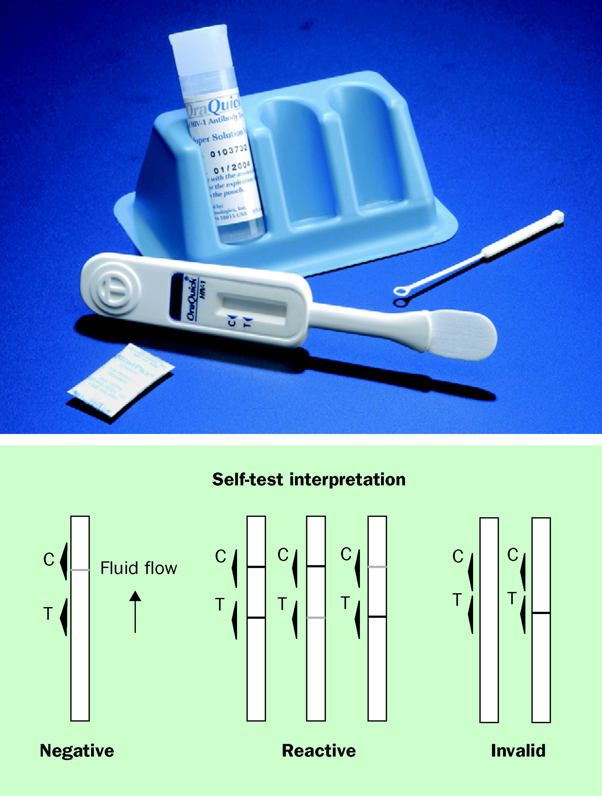
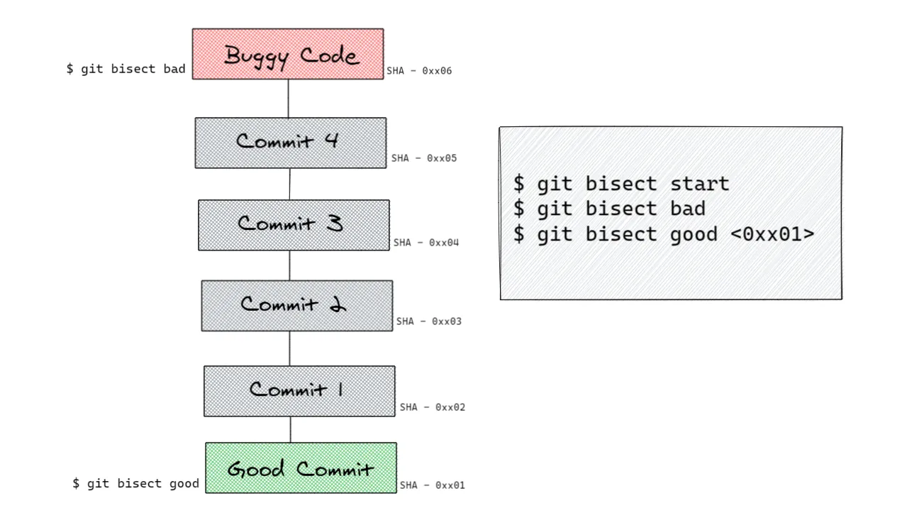
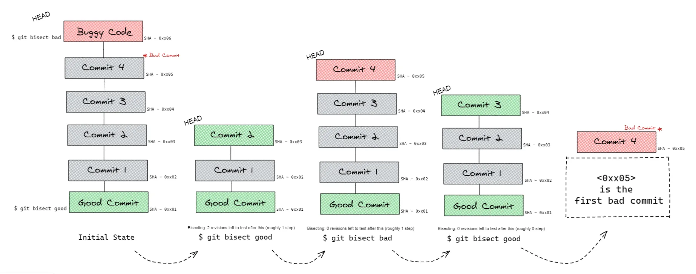
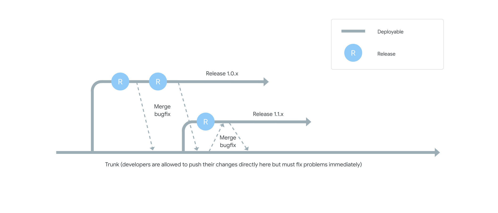
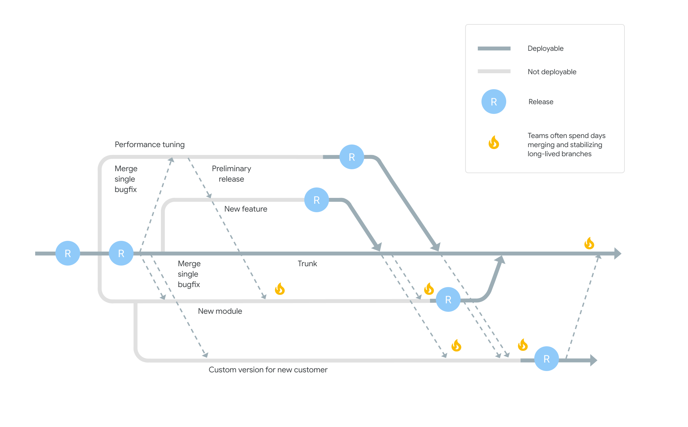
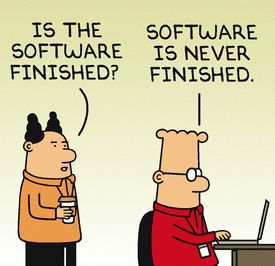
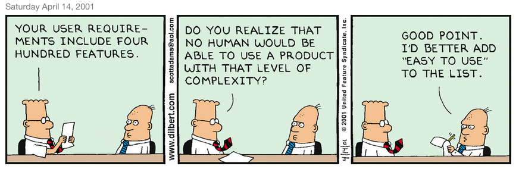
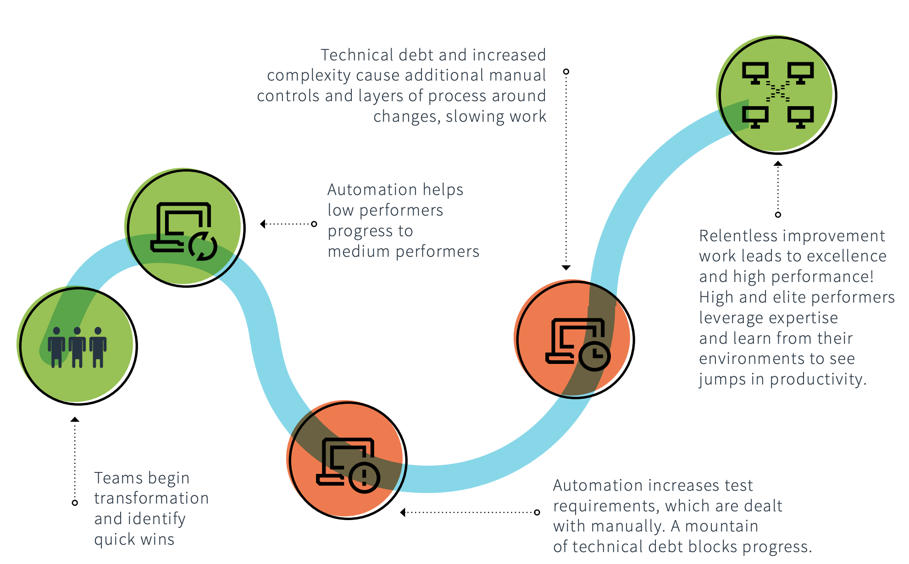

<!-- size: 16:9 -->
<!-- theme: default -->

<!-- paginate: skip -->

<!-- headingDivider: 0 -->

<style>
h1 {
  text-align: center;
  color: #005877;
}
h2 {
  color: #E87B00;
}
h3 {
  color: #005877;
}

img[alt~="center"] {
  display: block;
  margin: 0 auto;
}

emph {
  color: #E87B00;
}
</style>

# INTEGRACIÓN Y ENTREGA CONTINUAS

---

## Conceptos

- Integración continua
- Entrega continua
- Automatización del despliegue
- Trunk-based development

---

<!-- _class: invert -->

<style scoped>
section { justify-content: start; }
</style>

## Integración Continua


---

<style scoped>
section { justify-content: flex-end; }
emph {
  color: #E87B00;
  text-align: left;
  font-size: 32px;
}
</style>


<emph>_I've never lost a game,_</emph>
<emph>_I just ran out of time._</emph>

<emph>&emsp; Michael Jordan</emph>

<!--

CI sigue el principio de que si algo cuesta mucho esfuerzo, se debe hacer más a menudo para que sea menos doloroso.

-->

---

<!-- _class: invert -->
<style scoped>
section { text-align: center; }
</style>

<emph>¿Cómo funciona CI en la práctica?</emph>

---

## Ejemplo de CI a escala

Desarrollo de una nueva característica o _feature_...

Hacer <emph>check-out</emph> de una <emph>working copy</emph> en un <emph>repositorio</emph>
  
```bash
$ git clone https://github.com/sistemas-sw/construccion
Clonando en 'construccion'...
remote: Enumerating objects: 688, done.
remote: Counting objects: 100% (104/104), done.
remote: Compressing objects: 100% (74/74), done.
remote: Total 688 (delta 45), reused 84 (delta 29), pack-reused 584
Recibiendo objetos: 100% (688/688), 39.75 MiB | 22.49 MiB/s, listo.
Resolviendo deltas: 100% (296/296), listo.
```

---

| 📙 | Conceptos |
----:|:----
<emph>Control de versiones</emph> | git, cvs, subversion, mercurial, etc.
<emph>Repo</emph> | `uca-virtualizacion/devops` alojado en github
<emph>Mainline</emph> | estado actual del repositorio
<emph>Working copy</emph> | copia local del repositorio
<emph>Check out</emph> | clonar el repositorio en local

¡Cuidado! A diferencia de otros SCV antiguos, hacer `checkout` en git es cambiar de rama o restaurar los ficheros de un _working tree_.

---

Cambiarse al repo con la working copy local

```bash
$ tree -d construccion 
construccion/
├── docs
├── marp
└── slides
    ├── devops
    │   ├── docker
    │   │   ├── docs
    │   │   └── img
    │   ├── img
    │   ├── jenkins
    │   │   ├── entregable
    │   │   └── img
    │   ├── scv
    │   │   └── img
    │   └── terraform
    │       └── img
    ├── implementacion
    │   └── img
    └── marp
$ cd construccion 
```

---

Modificar el código fuente:

```bash
touch <FICHERO MODIFICADO>
```

---

Preparar el entorno de construcción:

```bash
$ cd marp
$ npm install --save @marp-team/marp-core

added 304 packages, and audited 305 packages in 3s

34 packages are looking for funding
  run `npm fund` for details

found 0 vulnerabilities
```

---

Construir en local (debería automatizarse):

```bash
$ cd ..
$ mkdir ./html/img
$ cp -R slides/devops/img/ ./html/img/
$ marp --allow-local-files --config-file ./marp/marp-engine.js --html slides/devops/cultura.md -o ./html/cultura.html
[  INFO ] Converting 1 markdown...
[  INFO ] slides/devops/cultura.md => html/cultura.html
$ open ./html/cultura.html
```

---

Ignorar el _build_ (carpeta `html/`) al sincronizar el repo:

```bash
$ cat .gitignore
...
# .gitignore para ignorar la carpeta html/
*.html
html/*.html
html/img/*.png
html/img/*.gif
*.pdf
**/html
...
```

---

A partir de ahora:

- Modificar _source code_ (ficheros `.md`) para hacer una tarea.
- Hacer tests de que el cambio funciona.
- `git add`, `git commit` y `git push` para subir los cambios al repositorio.

Con git:

- El _index_ guarda una instantánea del contenido del _working tree_.
- Hacer _commit_ es grabar los cambios en el repositorio (local).
- Hacer _push: es subir al repo global

---

Si alguien modifica algo...

```bash
$ git pull
remote: Enumerating objects: 7, done.
remote: Counting objects: 100% (7/7), done.
remote: Compressing objects: 100% (2/2), done.
remote: Total 4 (delta 2), reused 4 (delta 2), pack-reused 0
Desempaquetando objetos: 100% (4/4), 436 bytes | 109.00 KiB/s, listo.
Desde https://github.com/sistemas-sw/construccion
   fe24065..382de02  main       -> origin/main
Actualizando fe24065..382de02
Fast-forward
 marp/html-build.sh | 7 +++++--
 1 file changed, 5 insertions(+), 2 deletions(-)
```

---

Aún no hemos acabado. Hay que hacer un build (manual o automático) en un servidor de integración común.

- Si hay un conflicto entre dos desarrolladores, se suele detectar cuando el segundo hace un build sobre su copia de trabajo. Hay que arreglarlo lo antes posible.

- El repo debe quedar en todo momento con un software estable, funcional y con pocos errores.

- No hay que alejarse mucho de esa base estable pues llevaría mucho tiempo integrarse con ella.

Martin Fowler: [Building a feature with CI](https://martinfowler.com/articles/continuousIntegration.html#BuildingAFeatureWithContinuousIntegration)

<!--

-->

---

<style>
emph {
  color: #E87B00;
}
</style>


### Beneficios de CI

Abordar problemas del desarrollo:

- Software complejo
- Cambios inesperados e incompatibles
- Desarrollo en equipo

Ventajas:

- Retroalimentación rápida
- Lotes pequeños
- Calidad y productividad

<!--

Un sistema software es algo muy complejo. Un cambio aparentemente sencillo en un fichero puede tener efectos no deseados en el sistema. Cuando muchos desarrolladores trabajan en un grupo de sistemas relacionados, coordinar los cambios es difícil, porque los cambios de diferentes desarrolladores pueden ser incompatibles.

Las prácticas de integración continua (CI) sirven para abordar estos problemas. 

- CI propone crear ciclos de retroalimentación rápidos para garantizar que los desarrolladores trabajen en lotes pequeños.
- CI permite a los equipos producir software de calidad, reducir el coste de desarrollo y mantenimiento, y aumentar la productividad.

-->

---

### Prácticas de CI

- Un solo repositorio de código fuente
- Automatizar la construcción (build)
- Hacer el build self-testing
- Todos deben hacer commit al trunk todos los días
- Cada commit a la _mainline_ debe originar un build en un servidor de integración
- Arreglar inmediatamente los builds fallidos
- Mantener rápidos los build
- Etc.

Martin Fowler: [Practices of CI](https://martinfowler.com/articles/continuousIntegration.html#PracticesOfContinuousIntegration)

---

#### Un solo repositorio


- SCM, CVS, configuration management,...
  - Todo en el <emph>monorepo</emph>...
  - ...menos los productos del build
- Instalar SO, [IDE, SGBD] y... checkout!
- Minimizar número de ramas

<!--

- SCM, CVS, configuration management,...

- Poner en el repo todo lo necesario para hacer un build desde cero: código, test scripts, properties files, database schema, install scripts, third party libraries,... incluso compiladores (!)

- No poner en el repo los productos de un build, solo los scripts para hacerlo

- Antes de hacer un checkout para el build desde cero, quizá solo debería tener que instalarse un SO, un entorno de desarrollo (!) y un SGBD. A veces ni eso.

- Minimizar el número de ramas

-->

---


#### Automatizar los _build_

- Build tools: make, GNU Autotools, Apache ant, mvn, gradle, dotnet msbuild, Ruby rake, etc.
- Dependencias: Apache ivy, maven, npm, yarn, pip, conda, NuGet, cargo, etc.

No depender de los IDEs para hacer builds

<!--

-->

---

#### Hacer el build self-testing



- ¿Hacer TDD o XP?
- Suite de tests automatizados
- XUnit, UI tests (Selenium), APIs (Appium), Mocking (mockito), etc.
- SAST (SonarQube, ESLint, etc.)

<!--

- No es imprescindible hacer TDD o XP

- Pero hay que tener una suite de tests automatizados. Si falla uno, debe fallar el build

- Empezar con XUnit y seguir con pruebas de interfaz de usuario (Selenium), APIs (Appium), mocking (Mockito), etc.

- Integrar el análisis estático de código (SonarQube, ESLint)

-->

---

#### Todos deben hacer commit al trunk todos los días


- Encontrar problemas pronto
- Frecuentes merge de ramas en el trunk
- Diff debugging tras detectar fallos al ejecutar el build:
  `git bisect`

<!--

- Para arreglar pronto los problemas, hay que encontrarlos pronto. Hacer commit frecuentes ayuda.

- Si se trabaja en una rama, hay que hacer merge con frecuencia con el trunk

- También se detectan conflictos al ejecutar el build: hacer diff debugging (hacer checkout de código entre un par de fechas, averiguar cuándo se introdujo el cambio que provoca el fallo y hacer diff para ver qué ha cambiado)

-->

---
<style scoped>
section { justify-content: start; text-align: left; }
</style>

##### Búsqueda binaria de bugs en _commits_ (inicio)



<!--

Primero hay que proporcionarle un commit bueno y uno malo

Mensaje que dice cuántos pasos quedan hasta encontrar el commit malo

Bisecting: X revisions left to test after this (roughly Y steps)

-->

---
<style scoped>
section { justify-content: start; text-align: right; }
</style>

##### Búsqueda binaria de bugs en _commits_ (repetir pasos)



`$ git bisect reset`

<!--

Repetir en cada paso indicando si el bug aún persiste
- Si el bug persiste, git bisect bad
- Si el bug desaparece, git bisect good

Cuando se completan todos los pasos, git muestra el mensaje con el SHA del primer commit malo

Tras encontrar el commit que introdujo el bug, se puede resetear el git bisect

-->

---

#### 1 commit de _mainline_ $\Rightarrow$ 1 build en servidor de integración


- Update y build local... ¡no siempre se hace!
- Pues en mi máquina me funciona...
- Build en máquina compartida (manual vs. servidor de integración)
- Servidores de CI: Jenkins, Gitlab CI/CD, Teamcity, Bamboo, GitHub Actions, Azure DevOps services, CircleCI, Semaphore, etc.

<!--

Alguien puede no hacer un update y build local antes de hacer commit. Los desarrolladores pueden tener configuraciones diferentes en sus máquinas, así que hay que hacer los build en una máquina compartida

En el build manual el desarrollador se conecta y lanza el build.
El servidor de integración monitoriza el repositorio, lanza el build cuando hay un commit y notifica al desarrollador

Servidores de CI (algunos solo disponibles en la nube)

-->

---

<!-- _class: invert -->
<style scoped>
section { text-align: center; }
</style>

<emph>¿_Nightly builds_ es hacer integración continua?</emph>

<!--
Nightly builds no es hacer CI
-->

---

#### Arreglar inmediatamente los builds fallidos


- Prioridad 1
- Un par de personas basta
- Técnica rápida: revertir el commit más reciente que ha roto el build y debug en local
- Técnica para evitar romper la mainline: crear _working copy_ desde _head_ y hacer _commits_ en una rama <emph>pending-head</emph> diferente

<!--

Prioridad 1:  arreglar un build que falla

No todo el mundo tiene que dejar de hacer lo que está haciendo para arreglarlo. Con un par de personas suele ser suficiente. Para poder hacer esto hay que seguir un workflow que lo permita.

Manera rápida: revertir el commit más reciente que ha roto el build y hacer debug en local

Técnica pending-head para evitar romper el mainline: crear una working copy que se actualiza desde el head verdadero (para mantenerse sincronizado) pero hacer commits en una rama diferente pending-head.

-->

---

#### Mantener rápidos los build


- ¿1 hora es mucho? ¿10 minutos?
- Testing: cuello de botella
- _Build pipeline_ o _Staged build_
- Ejemplo: 2-stage pipeline
  1ª etapa rápida (compilación y pruebas unitarias sin la BD) $\rightarrow$  1er. commit build
  2ª etapa lenta (pruebas de integración con la BD real) $\rightarrow$  build secundario $\rightarrow$ si falla, añadir tests al commit build

<!--

El cuello de botella más habitual es el testing (en particular, si involucran servicios externos como bases de datos): mocking!

Deployment pipeline, aka build pipeline / staged build

Ejemplo two-stage pipeline: 1º rápida (compilación y pruebas unitarias sin la BD), 2º lenta (pruebas de integración con la BD real). El primer commit build se hace tras la 1ª etapa. Si falla el build secundario tras la 2ª etapa, es un síntoma de que hacen falta más tests en los commit builds.

-->

---

#### Otras prácticas de CI...

- Testear en un clon del entorno de producción
- Hacer que sea fácil para cualquiera obtener el ejecutable más reciente
- Todos pueden ver lo que está pasando
- Automatizar el despliegue

<!--

Test in a Clone of the Production Environment

Make it Easy for Anyone to Get the Latest Executable

Everyone can see what's happening

Automate Deployment

-->

---
<style scoped>
section { justify-content: start; }
</style>

### Trunk-Based Development (TBD)



<!--

La CI también incluye dos prácticas más, según Kent Beck y la comunidad XP:

1. La práctica de Trunk-Based Development (TBD), en la que los desarrolladores trabajan sobre el trunk (= master, main o mainline) en pequeños lotes y fusionan su trabajo regularmente en un trunk compartido, al menos una vez al día, en lugar de trabajar en ramas de features de larga duración.

2. La creación de suites de pruebas unitarias automatizadas mantenibles es compleja. Una manera de resolver este problema es practicar el TDD. Los desarrolladores escriben pruebas automatizadas que inicialmente fallan, antes de implementar el código que hace que las pruebas pasen.

-->

---
<style scoped>
section { justify-content: start; }
</style>

### Timeline no TBD



[TBD vs no TBD](https://dora.dev/devops-capabilities/technical/trunk-based-development/)

<!--

-->

---

### Controversia de CI

- Prácticas de CI son controvertidas
  - Dividir _features_ grandes en pasos pequeños
  - Lleva más tiempo completar las _features_ grandes

- Si los cambios son pequeños
  - Desarrollo + entrega más rápida y estable
  - Las ramas son de corta duración
  - Los desarrolladores reciben comentarios periódicos sobre el impacto de su trabajo en el sistema en conjunto
  - Es más fácil y rápido detectar, clasificar y solucionar problemas

CI es el paso previo a la CD

<!--

Las prácticas de CI se consideran a veces controvertidas.

- Requiere que los desarrolladores dividan las características grandes y otros cambios en pasos incrementales más pequeños que se puedan integrar con frecuencia en el trunk. Esto es un cambio para los desarrolladores que no están acostumbrados a trabajar de esta manera.

- Además, cuando los equipos cambian a usar pasos pequeños, puede llevar más tiempo completar las características grandes.

A pesar de estas objeciones, ayudar a los equipos de desarrollo de software a implementar la CI debería ser la prioridad número uno para comenzar el viaje hacia la CD.

El proceso de CI da como resultado un desarrollo y entrega de software más rápido y estable cuando los cambios son pequeños y autocontenidos, y las ramas en las que viven son de corta duración.

Trabajar en lotes pequeños también garantiza que los desarrolladores reciban comentarios periódicos sobre el impacto de su trabajo en el sistema en su conjunto, tanto de otros desarrolladores, probadores y clientes, como de las pruebas automatizadas de rendimiento y seguridad.

Esto hace más fácil y rápido detectar, clasificar y solucionar problemas.

-->

---
<!-- _class: invert -->

<style scoped>
section { justify-content: start; text-align: right; }
</style>


## Entrega Continua

---

<!-- _class: invert -->

<style scoped>
section { justify-content: flex-end; text-align: right; }
emph {
  color: #E87B00;
  text-align: right;
  font-size: 32px;
}
</style>


<emph>_Lo entregó todo al fuego,_</emph>
<emph>_que no hace distinción_</emph>

<emph>&emsp; Plutarco</emph>

---

<style scoped>
section { justify-content: start; }
</style>

## Entrega Continua


Se hace CD cuando:

- Software desplegable en cualquier momento
- Equipo prioriza mantener el software desplegable
- Tras un cambio, cualquiera puede saber rápidamente si el sistema está listo para producción
- Se puede desplegar con un click cualquier versión del software en cualquier entorno

---



## Beneficios de CD

- Despliegues con riesgo reducido
- Progreso creíble: ¿quién garantiza el _done_? ¿que esté en producción? ¿que lo digan los desarrolladores?
- Feedback de los usuarios: reduce el riesgo de construir algo inútil

  Cuanto antes te des cuenta...

---

<style scoped>
section { justify-content: start; text-align: center; }
</style>

### Cuanto antes te des cuenta, mejor



---

### Cómo implementar CD

- Automatizar el build, las pruebas y el despliegue
- Trunk-based development
  - nº ramas activas < 3
  - ramas y forks con vida corta (< 1 día)
  - pocos locks del código (merge conflicts, freezes, etc.)
- Shift-left de la seguridad
- <emph>Arquitectura poco acoplada</emph>
- Dejar a cada equipo elegir sus herramientas
- Control de versiones de configuraciones y scripts de despliegue
- <emph>Gestión de cambios en la base de datos</emph>: _fixtures_

<!--

Arquitectura poco acoplada: permite a los equipos probar y desplegar sus aplicaciones de forma independiente, sin necesidad de orquestación con otros servicios. Permite trabajar de forma independiente sin depender de otros equipos para obtener soporte y servicios.

Gestión de cambios en la base de datos: almacenar los cambios de la BD como scripts en el control de versiones (y gestionar estos cambios de la misma manera que los cambios de la aplicación en producción)

-->

---

### Errores comunes al implementar CD

- Creer que CD implica hacer despliegues frecuentes
- No hacer cambios en las capacidades técnicas necesarias para hacer CD
- Centrarse solo en herramientas y patrones (v.g. deployment pipeline)
- No hacer CD porque no se puede hacer CDEP

---
<style scoped>
section { justify-content: start; }
</style>

### Transformación



<!--

Al principio de la curva de transformación se logran victorias rápidas.

En una etapa inicial de mejora, la automatización ayuda a progresar de un bajo rendimiento a un rendimiento medio.

En el punto más bajo de la curva, la automatización aumenta los requisitos de prueba, que se tratan manualmente. La gran cantidad de deuda técnica bloquea el progreso.

Al salir de la curva, la deuda técnica y el incremento de complejidad ralentizan el trabajo, provocando añadir controles manuales y más capas de procesos tras cada cambio.

Sólo en la parte alta de la curva, el trabajo de mejora realizado logra un rendimiento alto.

-->
