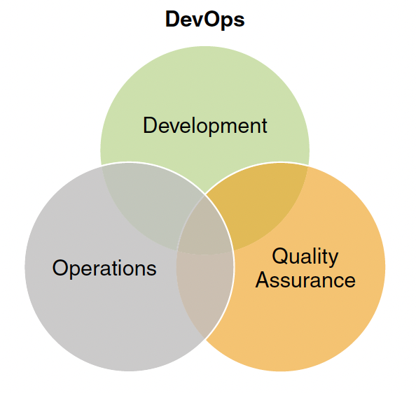
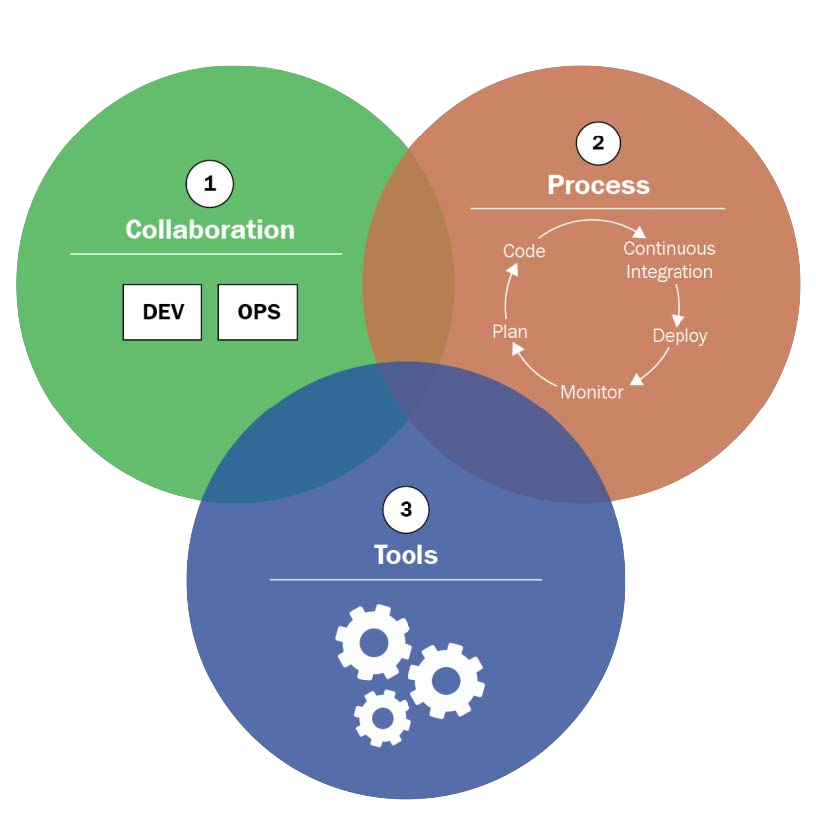
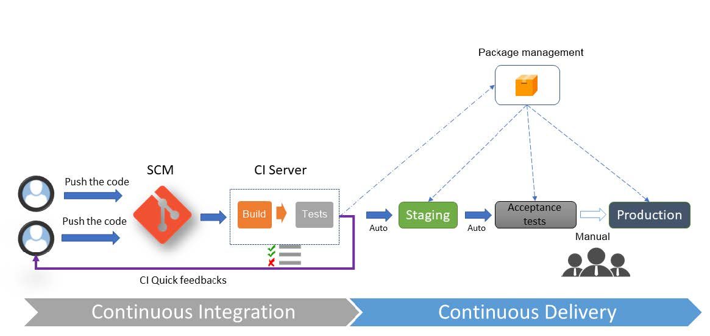
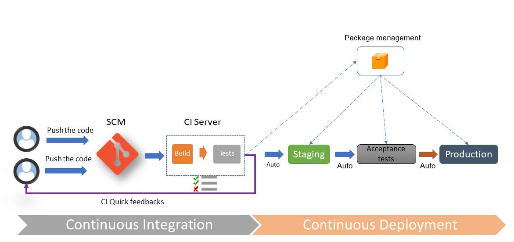
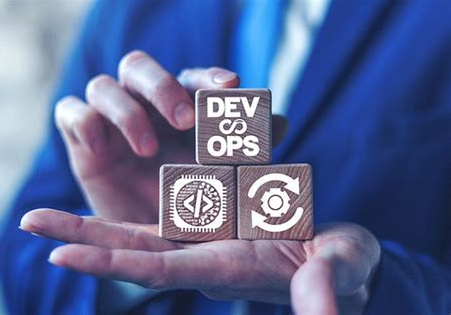

<!-- size: 16:9 -->
<!-- theme: vs -->

<!-- paginate: skip -->

<!-- headingDivider: 0 -->

<style>
h1 {
  text-align: center;
  color: #005877;
}
h2 {
  color: #E87B00;
}
h3 {
  color: #005877;
}

img[alt~="center"] {
  display: block;
  margin: 0 auto;
}

emph {
  color: #E87B00;
}
</style>

# CULTURA DEVOPS

---

<!-- _class: invert -->
<style scoped>
section { text-align: center; }
</style>

<emph>¿Qué es DevOps?</emph>

---

## ¿Qué es DevOps?



- <emph>Dev</emph>elopment + <emph>Op</emph>erations

  - Concepción > Desarrollo > Entrega

- Procesos ágiles

  - _Lean manufacturing_

<!--

El foco principal de DevOps es maximizar el flujo de creación de software: desde la concepción, hasta el desarrollo y la entrega.

- Los desarrolladores quieren innovar y entregar más rápido
- Los sysadmin quieren garantizar la estabilidad de los sistemas en producción y la calidad de los cambios

La cultura DevOps  es un conjunto de prácticas que reducen las barreras entre desarrolladores y operaciones.

- Los desarrolladores están acostumbrados a procesos ágiles, como Scrum y XP, para reducir los tiempos de entrega.
- Pero los procesos ágiles ya involucran también a los equipos de negocio
- Sin embargo, falta incluir a los de operaciones en estos equipos

La cultura DevOps es como una extensión de los procesos ágiles a todos los equipos, tanto desarrolladores como negocios y operaciones.

- DevOps está muy influenciado por la tendencia al lean manufacturing

-->

---

| 📙 | Definiciones |
----:|:----
<emph>Desarrollo</emph> |  Se refiere al proceso de crear software, donde los desarrolladores escriben y actualizan el código fuente de las aplicaciones.
<emph>Operaciones</emph> | Se centran en la gestión y mantenimiento de los sistemas y la infraestructura en los que se ejecuta el software. Incluye tareas como la configuración, el monitoreo y la resolución de problemas.

---

## ¿Qué es DevOps?

<iframe width="1000" height="684" src="https://www.youtube-nocookie.com/embed/Xrgk023l4lI" title="DevOps In 5 Minutes | What Is DevOps?| DevOps Explained | DevOps Tutorial For Beginners |Simplilearn" frameborder="0" allow="accelerometer; autoplay; clipboard-write; encrypted-media; gyroscope; picture-in-picture; web-share" allowfullscreen></iframe>

---

## Elementos clave en DevOps

- <emph>Deployment</emph> (despliegues) frecuentes
- Pruebas automáticas
  - TDD: _Test-driven design_
  - BDD: _Behavior-driven design_
- CI/CD: _Continuous <emph>Integration</emph> + Continuous <emph>Delivery</emph>_
- Feedback de usuarios
- Monitorización de apps/infraestructura

<!--

Para facilitar la colaboración y comunicación entre Devs y Ops hacen falta varias cosas:

- Despliegues frecuentes
- Automatizar las pruebas unitarias y de integración, con TDD y BDD.
- Prácticas de integración y entrega continuas (CI/CD)
- Recopilar el feedback de los usuarios tras cada nuevo despliegue.
- Monitorizar las aplicaciones y la infraestructura.

-->

---

<!-- _class: invert -->
<style scoped>
section { text-align: center; }
</style>

<emph>¿Qué significan **integración**, **entrega** (_delivery_) y **despliegue** (_deployment_)?</emph>

---

<!-- _class: invert -->
<style scoped>
section {
  justify-content: start;
  text-align: right;
}
</style>

_On your marks, get set,... go!_


---

| 📙 | Definiciones |
----:|:----
 **<emph>Integración</emph>**  continua   | Llevar automáticamente los cambios de <emph>varios desarrolladores</emph> en el código de una aplicación a un <emph>repositorio</emph> compartido para cada nueva versión.
 **<emph>Entrega</emph>**  continua  | Trasladar la aplicación de software desde el entorno de desarrollo y dejarla <emph>disponible para</emph> su despliegue en un entorno de producción. Incluye pruebas, empaquetado y preparación de cada _<emph>release</emph>_.
**<emph>Despliegue</emph>**    | Instalación de una aplicación en su entorno de <emph>producción</emph>, ya sea en un servidor, un conjunto de servidores, un contenedor, la nube, etc.
 
<!--

El despliegue es el "¡ya!" en "preparados, listos... ¡ya!"

La integración podría ser el "¡a sus puestos!"

-->

---

<!-- _class: invert -->
<style scoped>
section { text-align: center; }
</style>

<emph>¿DevOps es un nuevo rol?</emph>

---


<!--

Muchos piensan que DevOps es un rol de TI, un híbrido entre desarrollador y administrador de sistemas.

El problema de este pensamiento es que las empresas tienden a crear un nuevo silo llamado DevOps e intentan llenarlo con superadministradores que saben mágicamente de ambas cosas.

-->

---

## ¿Qué no es DevOps?

- Es una <emph>cultura</emph>, no un rol

  - Si fuese un rol $\Rightarrow$ nuevo núcleo aislado (silo)
  - No son superhumanos

- Responsabilidades: <emph>desarrollo</emph> (código), <emph>calidad</emph> (pruebas) y <emph>operaciones</emph> (sysadmin)
  - No exclusivas
  - Proceso colaborativo

<!--

El problema de este pensamiento es que las empresas tienden a crear un nuevo silo llamado DevOps e intentan llenarlo con superadministradores que saben mágicamente de ambas cosas.

Más que un rol, DevOps es un cambio cultural en la forma en que se crea software.

El objetivo no es contratar personas superhumanas, sino construir sistemas con una nueva mentalidad:

- Las necesidades de desarrollo, calidad y operaciones están interrelacionadas. Los desarrolladores ya no serán responsables solo del código, los probadores solo de las pruebas y los sysadmins solo de la operación del sistema.

- Deben formar parte de un proceso colaborativo

DevOps está más centrado en la colaboración entre equipos que en la creación de un nuevo rol.

-->

---

<!-- _class: invert -->
<style scoped>
section { text-align: center; }
</style>

<emph>¿Es DevOps equivalente a _Site Reliability Engineering_ (SRE)?</emph>

<!--

No es Site Reliability Engineering, que es más bien un rol de operaciones, enfocado en cómo garantizar la fiabilidad y la escala en los sistemas en producción.

DevOps es más una cultura, indica qué conseguir. Pero habitualmente se suele mezclar con el cómo y se convierte en un rol.

-->

---

<!-- _class: invert -->
<style scoped>
section { text-align: center; }
</style>

<emph>¿Por qué DevOps?</emph>

---

## Motivación

- Sistemas frágiles

  $\Leftarrow$ Falta de comunicación y herramientas

  $\Rightarrow$ Despliegues complejos y propensos a errores

- Deuda técnica

- Arquitectura poco sólida
- Requisitos no funcionales poco solventes

<!-- 

El movimiento DevOps surgió de la frustración de muchos profesionales que trabajaban con sistemas frágiles.

Frágiles porque el software se construye en silos donde los diferentes equipos no se comunican entre sí de una forma eficaz.

Debido a esta falta de comunicación, los desarrolladores no suelen disponer de entornos y herramientas para ser productivos, y el equipo de operaciones suele recibir el software como un "ahí llevas eso" (para que le des soporte).

Los despliegues son complejos y propensos a errores.

Los sistemas, cargados de deuda técnica, originan un trabajo no planificado.

Los desarrolladores se ven obligados a tomar atajos, que suelen dar lugar a una arquitectura poco sólida y un retraso en los requisitos no funcionales, como la seguridad y la mantenibilidad.

-->


---

| 📙 | Definiciones |
----:|:----
 <emph>Deuda técnica   | Decisiones tomadas durante el desarrollo de un software que, en el corto plazo, permiten un desarrollo más rápido o una solución temporal, pero que crean problemas a largo plazo en términos de NFR
 <emph>Requisitos No Funcionales (NFR) | Aspectos que no están relacionados directamente con la funcionalidad de un sistema software, sino con características no directamente vinculados a sus funciones específicas (rendimiento, usabilidad, confiabilidad, seguridad, eficiencia, etc.)
 <emph>Arquitectura software | Estructura y diseño organizativo de un sistema de software, sobre cómo sus <emph>componentes</emph> interactúan entre sí y cómo se organizan para lograr sus objetivos de manera efectiva. Proporciona un marco conceptual para abordar aspectos de los NFR.

---

## Cultura DevOps



[Definición de Donovan Brown](https://www.donovanbrown.com/post/what-is-devops)

> DevOps es la unión de personas, procesos y productos para una entrega continua de valor a los usuarios finales

- Procesos con Agilidad
- Personas en Colaboración
- Productos con Herramientas

<!--

DevOps es la unión de personas, procesos y productos para una entrega continua de valor a los usuarios finales.

¿Cuál es el proceso? Muy similar a los procesos ágiles, incluyendo los elementos clave descritos antes: CI/CD, monitorización, etc.

¿Qué hacen las personas? Colaborar, comunicarse y compartir responsabilidades.

¿Cómo se crea el producto? Usando herramientas que automaticen todos los elementos del proceso y faciliten la colaboración y la comunicación.

-->

---

## CI/CD: Continous Integration / Continuous Delivery


- Continuous integration (CI)
- Continuous delivery (CD)
- Continuous deployment

Cada proceso tiene su propio <emph>pipeline</emph>

<!--

Cada uno de estos procesos tiene su propio pipeline

-->

---

### Pipeline de CI


<!--

CI es la práctica de construir y probar las aplicaciones en cada nueva versión.

-->

---

### Pipeline de CD



<!--

CD añade pruebas automáticas y despliegue automático al proceso de CI.

Gracias a CD, el software entregado debe funcionar siempre.

Todos los cambios que se incorporan en un _build_ pueden formar parte de un candidato a _release_.

Antiguamente, los cambios pequeños solían tener que esperar a que se completaran otros muchos antes de ser empaquetados en una release. Siguiendo ese modelo, se suponía que el software era incorrecto hasta que era validado por profesionales de QA. Todas las pruebas se realizaban después del desarrollo, la responsabilidad de la calidad recaía exclusivamente en el equipo de QA.

-->

---

### Continuous Deployment



<!--

El despliegue continuo es la práctica de desplegar automáticamente el software en producción después de cada cambio.

La entrega es manual, el despliegue es automático.

-->

---

| 📙 | Definiciones |
----:|:----
<emph>Build</emph>   | acción de compilar y ensamblar el código fuente de una aplicación en un formato ejecutable o en un conjunto de artefactos que se pueden utilizar en un entorno de ejecución específico
<emph>Pipeline</emph>   | un conjunto automatizado y secuencial de procesos que permiten la ejecución de tareas específicas. Analogía de una línea de montaje de la industria de fabricación
<emph>Staging</emph> | entorno de prueba que replica el entorno de producción para realizar pruebas finales (con usuarios) antes del despliegue

---

| 📙 | Definiciones |
----:|:----
<emph>Artefacto</emph> | resultado del _build_. Pueden ser binarios ejecutables, bibliotecas, paquetes de instalación, etc., necesarios para ejecutar la aplicación
<emph>Release</emph> | una versión específica y completa de una aplicación o software que se considera lista para ser distribuida y utilizada por los usuarios finales
<emph>Release Candidate (RC)</emph> | _release_ con el potencial de convertirse en la versión final o lanzamiento si no se encuentran problemas significativos durante las pruebas

---



## Prácticas DevOps

1. Automatizar la infrastructura: <emph>IaC</emph>
2. Automatizar los despliegues: <emph>Provisioning</emph>
3. Medir, monitorizar y experimentar: <emph>Feature flags</emph>

---

### 1. Automatizar la infrastructura

- <emph>IaC: _Infrastructure as Code_</emph>

- Provisioning
- Feature flags

<!--

IaC es el proceso de escribir el código de las etapas de aprovisionamiento y configuración de los componentes de la infraestructura, lo que ayuda a automatizar su implementación de manera repetible y consistente.

La forma de permitir el self-service provisioning es crear un conjunto estándar de imágenes de máquinas se puedan solicitar bajo demanda. Estas imágenes representan máquinas estándar con todos los controles de seguridad, políticas y paquetes de software estándar instalados.

Por ejemplo, un desarrollador que necesira un servidor web con Ruby puede seleccionar, de entre un conjunto estándar de imágenes de máquinas, un servidor de aplicaciones NGINX, un servidor de base de datos MySQL, etc. El desarrollador no tiene que configurar ninguno de estos entornos.

En su lugar, solo tiene que solicitar una imagen y un entorno de destino. El entorno se aprovisiona automáticamente y el desarrollador puede empezar a trabajar.

-->

---

#### IaC por configuración

##### Contenerización e inmutabilidad

<emph>Máquinas virtuales</emph> (mutables) versus <emph>Contenedores</emph> (inmutables)

##### Ejemplo con Docker

Dockerfile:

```dockerfile
FROM ubuntu
RUN apt-get update
RUN apt-get install -y nginx
ENTRYPOINT ["/usr/sbin/nginx","-g","daemon off;"]
EXPOSE 80
```

<!--

La contenerización consiste en desplegar aplicaciones en contenedores en lugar de desplegarlas en máquinas virtuales.

Por ejemplo, Docker es una herramienta que permite crear, desplegar y ejecutar aplicaciones en contenedores. Las imágenes de los contenedores se crean a partir de un fichero Dockerfile. Este fichero contiene la declaración de la imagen base, que representa el sistema operativo a utilizar, middleware adicional a instalar en la imagen y la configuración de red de los puertos. Solo contiene los ficheros y binarios necesarios para la aplicación.

Lo que se ha descrito puede funcionar en una IaaS. Pero también en una PaaS, donde los desarrolladores pueden realizar la misma funcionalidad de autoservicio utilizando la interfaz de usuario de la PaaS.

Es importante que esta IaC sea inmutable, es decir, que no se pueda modificar una vez creada. Si se necesita un cambio, se crea una nueva versión de la imagen.

A diferencia de las VMs, los contenedores son inmutables, es decir, la configuración de un contenedor no puede modificarse durante su ejecución.

-->

---

#### IaC mediante scripting

[Ejemplo usando Azure CLI](docs/iac-ejemplos.md#ejemplo-usando-azure-cli):

```shell
az group create --location westeurope --resource-group MyAppResourcegroup
```

[Ejemplo usando Azure PowerShell](docs/iac-ejemplos.md#ejemplo-usando-azure-powershell):

```shell
New-AzResourceGroup -Name MyAppResourcegroup -Location westeurope
```

---

#### IaC con tipos declarativos

- Terraform / OpenTofu
- Vagrant
- Ansible
- Azure ARM template
- Azure Bicep
- PowerShell DSC
- Puppet
- Chef
- Etc.

<!--

Hay lenguajes declarativos en los que es suficiente escribir el estado del sistema o la infraestructura deseada en forma de configuración y propiedades.

Este es el caso, por ejemplo, de Terraform y Vagrant de HashiCorp, Ansible, Azure ARM template, Azure Bicep, PowerShell DSC, Puppet y Chef.

-->

---

[Ejemplo usando terraform](docs/iac-ejemplos.md#iac-con-tipos-declarativos) para definir un _resource group_ de Azure:

```hcl
terraform {
  required_providers {
    azurerm = {
      source  = "hashicorp/azurerm"
      version = "~> 3.0.2"
    }
  }
  required_version = ">= 1.1.0"
}
provider "azurerm" {
  features {}
}
resource "azurerm_resource_group" "rg" {
  name = "MyAppResourceGroup"
  location = "West Europe"
  tags = {
    environment = "Demo"
  }
}
```

---

<emph>Ejemplo usando terraform</emph> para definir un servicio de AWS con un contenedor de Docker que sirve una página web en un cluster de ECS

```hcl
provider "aws" {
  region = "West Europe" # Cambia esto según tu región de AWS
}

resource "aws_ecs_cluster" "example_cluster" {
  name = "example-cluster"
}

resource "aws_ecs_task_definition" "example_task" {
  family                   = "example-task"
  network_mode             = "bridge"
  requires_compatibilities = ["EC2"]
...
```

---

```hcl
...
  container_definitions = <<EOF
[
  {
    "name": "example-container",
    "image": "nginx:latest",
    "portMappings": [
      {
        "containerPort": 80,
        "hostPort": 80
      }
    ]
  }
]
EOF
}
...
```

---

```hcl
...
resource "aws_ecs_service" "example_service" {
  name            = "example-service"
  cluster         = aws_ecs_cluster.example_cluster.id
  task_definition = aws_ecs_task_definition.example_task.arn
  launch_type     = "EC2"
  desired_count   = 1

  network_configuration {
    # Coloca las ID de tus subredes aquí
    subnets         = ["subnet-xxxxxxxxxxxxxx", "subnet-yyyyyyyyyyyyyy"]
    # Coloca la ID de tu grupo de seguridad aquí
    security_groups = ["sg-xxxxxxxxxxxxxxxxx"]                           
  }
}
```

---

### 2. Automatizar los despliegues

- IaC: _Infrastructure as Code_

- <emph>Provisioning</emph>

- Feature flags

<!--

En los viejos tiempos, los despliegues eran procesos manuales engorrosos que solían depender de personas específicas que conocían los pasos necesarios para desplegar un build.

El proceso no era repetible debido a la intervención manual requerida y los despliegues eran ejercicios temidos que ocurrían tarde por la noche o temprano por la mañana.

La automatización de los despliegues tiene como objetivo resolver todos estos problemas.

-->

---

#### Provisioning (aprovisionamiento)

##### Opciones

- PaaS
- Recursos serverless
- Red

##### Herramientas

- terraform
- Azure ARM template, Azure CLI, Azure PowerShell
- AWS Cloud training
- Google Cloud Deployment Manager
- Etc.

<!--

El aprovisionamiento es la creación de los recursos que forman la infraestructura. Puede aprovisionarse un PaaS o un tipo de recurso serverless, como una app web, una Azure function o un Event Hub. Pero también puede aprovisionarse la parte de red que se gestiona, como VNet, subnets, tablas de encaminamiento o un cortafuegos de Azure.

Para las máquinas virtuales, el aprovisionamiento solo crea o actualiza el recurso cloud de la VM, pero no su contenido.

Hay varias herramientas de aprovisionamiento, como terraform, ARM template, AWS Cloud training, Azure CLI, Azure PowerShell y Google Cloud Deployment Manager.

-->

---

#### Buenas prácticas de IaC

- Automatizar todo en el código
- SCM: _Source Control Manager_
- Guardar el código junto al de la aplicación
- Código de la IaC debe ser <emph>idempotente</emph>
- Integrar con CI/CD

<!--

IaC, al igual que el desarrollo software, requiere prácticas y procesos que permitan que el código de la infraestructura evolucione y se pueda mantener.

- Todo debe estar automatizado en el código: hay que codificar y automatizar todos los pasos de aprovisionamiento y no dejar fuera pasos manuales que distorsionen la automatización de la infraestructura.

- Al igual que el código de las aplicaciones, el código de la IaC debe estar sometido a un source control manager o SCM para poder versionarlo, rastrearlo, fusionarlo y restaurarlo. Así se tiene una mejor visibilidad del código entre Devs y Ops.

- El código de la IaC debe guardarse junto al código de la aplicación, si es posible en el mismo repositorio. Así se asegura una mejor organización del trabajo entre desarrolladores y operaciones, que compartirán el mismo espacio de trabajo.

- Los scripts deben tener en cuenta el estado de la infraestructura cuando se ejecutan y no generar un error si el recurso que se va a crear ya existe, o si un recurso que se va a eliminar ya se ha eliminado. Los lenguajes declarativos, como Terraform, asumen este aspecto de la idempotencia de forma nativa.

Por lo tanto, la IaC, al igual que los procesos de CI/CD, es una práctica clave de la cultura DevOps que permite desplegar y configurar una infraestructura. La IaC solo puede ser eficaz con herramientas adecuadas.

Para las pruebas locales de infraestructura, algunas herramientas como Vagrant pueden simular un entorno local.

-->

---

### 3. Medir, monitorizar y experimentar

- IaC: _Infrastructure as Code_

- Provisioning

- <emph>Feature flags</emph>

<!--

Supongamos que un product manager tiene la teoría de que el proceso de registro es demasiado complejo para algunos usuarios y quiere probar un nuevo formulario más sencillo. La nueva página de registro se puede querer configurar para que se muestre cada vez que se solicite, de modo que el equipo pueda comparar las métricas de los usuarios de la nueva página con las de los usuarios de la página antigua.

La cultura DevOps fomenta este tipo de experimentación fail fast. 

-->

---

#### Feature flags

- A/B testing
- Distintas versiones, geografías, periodos de tiempo, navegadores, dispositivos, etc.
- Experimentos en producción

<!--

Una tendencia actual es el uso de feature flags. Las feature flags permiten configurar características que se pueden activar o desactivar, o que solo estén disponibles para un determinado grupo de usuarios.

Aprovechando las feature flags, podemos ejecutar experimentos como A/B testing para recopilar información y aprender sobre el sistema y sus usuarios.

- Mediante feature flags y configuraciones, se puede configurar que la página de registro se muestre de un modo que el equipo pueda comparar las métricas de los usuarios de la nueva página con las de los usuarios de la página antigua.

- Otra opción sería probar una característica en determinadas geografías, periodos de tiempo, navegadores o dispositivos.

Las feature flags también se pueden utilizar para probar características en producción con una carga de trabajo real. La característica se puede habilitar para un grupo de prueba o como un lanzamiento beta para una ubicación seleccionada. Después se puede supervisar de cerca y desactivarla una vez que se haya recopilado suficiente información o si se hay problemas. 

En resumen, con la automatización de infraestructura, despliegues con un solo clic y configurando feature flags, se puede experimentar, aprender y ajustar rápidamente.

-->

---

| 📙 | Definiciones |
----:|:----
<emph>IaC</emph> | práctica en la que la infraestructura de sistemas, redes y otros recursos tecnológicos se gestiona y <emph>aprovisiona</emph> utilizando código y archivos de configuración en lugar de realizar configuraciones manuales o a través de interfaces gráficas
<emph>Provisioning</emph> |  proceso de preparar y configurar de manera automática los recursos de infraestructura necesarios para ejecutar una aplicación o servicio
<emph>Feature flags</emph> |  técnica de desarrollo de software que permite habilitar o deshabilitar características específicas de una aplicación durante o después del despliegue

---

<!-- _class: invert -->
<style scoped>
section { text-align: center; }
</style>

<emph>¿Qué tiene todo esto que ver con el _cloud computing_?</emph>

---

<!-- _class: invert -->
<style scoped>
section { text-align: center; }
</style>

<emph>¿Es la CI/CD obligatoria para hacer _cloud computing_?</emph>

<!--
La cultura DevOps, CI y CD no son obligatorias para construir software en la nube.

De hecho, para una empresa grande y tradicional con muchos procesos y ciclos de entrega largos, todo esto puede sonar como una fantasía.
-->

---

## Relación con cloud computing

- IaC
- Agilidad / lean

<!--

Pero DevOps y CI/CD evolucionaron a partir de las prácticas innovadoras que aprovecharon una de las mayores ventajas de la computación en la nube: la infraestructura como código, y la pusieron en marcha junto con algunas de las mejores prácticas de la fabricación lean.

Una de las grandes promesas de la computación en la nube es la agilidad: una oportunidad para llegar al mercado más rápido que nunca.

Pero hace falta algo más que tecnología para lograr esa agilidad. Se necesitan personas, procesos y tecnología.

-->

---

## Tutoriales recomendados


- [Azure CLI](https://learn.microsoft.com/es-es/cli/azure/get-started-with-azure-cli?view=azure-cli-latest)
- [Azure PowerShell](https://learn.microsoft.com/es-es/powershell/azure/get-started-azureps?view=azps-10.2.0&viewFallbackFrom=azps-1.7.0) (sólo para Windows)
- [IaC con terraform](https://developer.hashicorp.com/terraform/tutorials/azure-get-started/infrastructure-as-code)