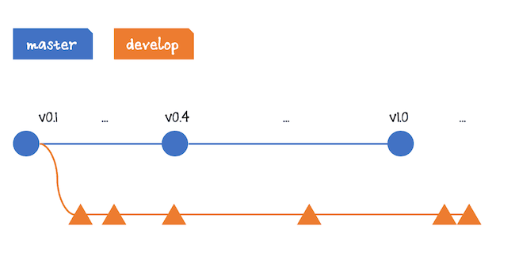
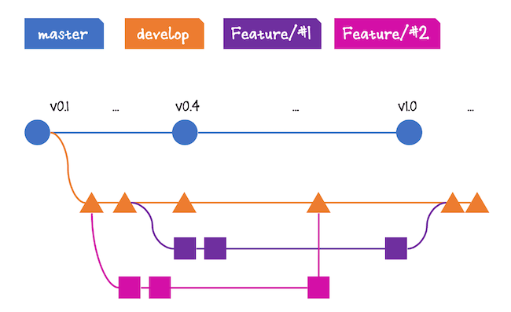
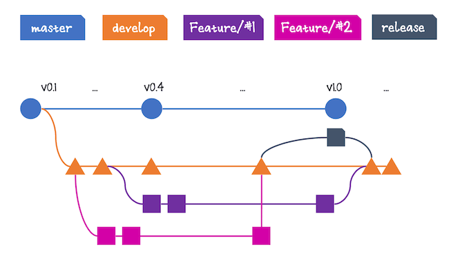
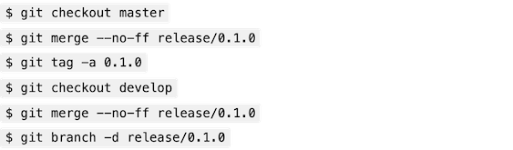
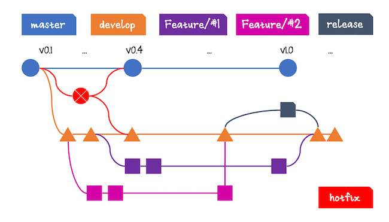
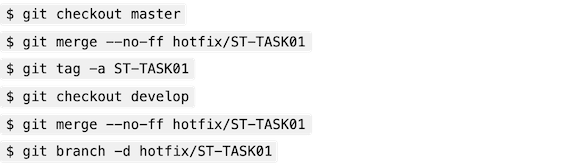

# Gitflow

`gitflow` is an auxiliary tool that facilitates the job of working with GitFlow by providing some useful commands.

## Installation

- To install it on [macOS](https://github.com/nvie/gitflow/wiki/Mac-OS-X):

  `brew install git-flow`

- For [Windows](https://github.com/nvie/gitflow/wiki/Windows), GitFlow commands come with [Git SCM](https://git-scm.com/download/win).

  `winget install --id Git.Git -e --source winget`

- For Ubuntu Linux users:

  `apt-get install git-flow`

- [Other Linux](https://github.com/nvie/gitflow/wiki/Linux) distributions

To create, browse and manage an example git repository on GitHub, we'll use the [GitHub CLI](https://github.com/cli/cli) command `gh`. You can install it for [MacOS](https://github.com/cli/cli#macos), [Linux](https://github.com/cli/cli#linux--bsd) or [Windows](https://github.com/cli/cli#windows).

After installig `gh`, you can login to your GitHub account with the command:

```bash
gh auth login
```

This will open a browser window to authenticate you with GitHub and provide it with a one-time token generated by `gh`.

## Main branches

The first step is to understand the roles of the `develop` and `master` branches and how they communicate with the versions of your code. These branches are the most important ones and the key to GitFlow.



GitFlow works primarily with two main branches:

- The `master` branch (in blue) stores all the released features until the date, receives the incoming new features from the develop (and only from it), as well as the hotfix changes.

- The `develop` branch (in orange), which has as the only role receiving the changes from the feature branches and centralizing them before any further merge. It’s here where the teams usually customize the agile process with steps like validations, code review, definitions of done, etc.

## Creating the GitHub Example Repo

Start with the creation of a new GitHub repo to hold the workflow example. For this, go to your GitHub account, create a new repo, and fill it with the following options:

```bash
gh repo create st-git-flow --private --description "A repo to test the Gitflow workflow"
```

Next, create a new folder on your local computer with the same repository name (`st-git-flow``) and then navigate to the folder via the command line.

```bash
mkdir st-git-flow
cd st-git-flow
```

Then, run the following commands, substituting your repository URL:

```bash
echo "# Hello World, GitFlow!" >> index.md
git init
git add .
git commit -m "first commit"
git branch -M master
git remote add origin https://github.com/XXXXXX/st-git-flow.git
git push -u origin master
```

- The first command creates a new Markdown file, with a hello world message. After that, you initialize the Git repo, adding all the files as Git files, and committing.
- The two last commands take care of adding the remote origin and pushing the master branch to the remote repo.

The remote origin can be seen right after the repo creation:

```bash
gh repo view
```

Now’s time to run the git flow init command.

```bash
git flow init
```

When it finishes, this is the output you may see (`ST` is the prefix chosen for the tags):

```text
Which branch should be used for bringing forth production releases?
   - master
Branch name for production releases: [master] 
Branch name for "next release" development: [develop] 

How to name your supporting branch prefixes?
Feature branches? [feature/] 
Release branches? [release/] 
Hotfix branches? [hotfix/] 
Support branches? [support/] 
Version tag prefix? [] ST
```

It creates the master and develop branches, and asks for the respective names of each feature, release, hotfix, and support branches. You can leave them as they are, and press enter until the end except for the version tag prefix.

In order to compare Git Flow to Git, we’ll provide the equivalent Git commands. The equivalent Git command to achieve this is:

<!--
`$ git checkout -b develop master`
-->


Whenever a developer is going to start a new feature, the `feature` branch must be created from the `develop`. This is the branch that hosts the _next release_ development.

Some team’s Git administrators even block the possibility of generating new branches from the master branch for security reasons. However, `gitflow` doesn’t push the develop branch to the remote origin. This is something you must do manually:

```bash
git push -u origin develop
```

This is the output:

```text
Total 0 (delta 0), reused 0 (delta 0), pack-reused 0
remote: 
remote: Create a pull request for 'develop' on GitHub by visiting:
remote:      https://github.com/XXXXXX/st-git-flow/pull/new/develop
remote: 
To https://github.com/XXXXXX/st-git-flow.git
 * [new branch]      develop -> develop
branch 'develop' set up to track 'origin/develop'.
```

## The Feature Branches

Pay attention to the two new feature branches below:



There’s no right due date for a task; it can take one day or two months to complete. It’s up to the team to decide the maximum time they’re going to need for any feature.

Feature #2, for example, was started before #1, and finished first, too. Not just this, it has finished in the middle of task #1. For GitFlow, it doesn’t matter how many features you’re developing at the same time; the flow guarantees that they’ll get to the `develop` and, in the next release, to the `master`.

If you merge feature #2, for example, and some breaking changes were introduced (i.e., if it adds code that conflicts with the code being developed in feature #1), then feature #1’s merge will fail.

In this type of situation, which is very common by the way, it’s normal to have the developers talking to each other when merge fixing, to analyze if what one has done is going to break the code of the other.

Create your first feature branch with this command:

```bash
git flow feature start ST-TASK01
```

And this is the result:

```text
Switched to a new branch 'feature/ST-TASK01'

Summary of actions:
- A new branch 'feature/ST-TASK01' was created, based on 'develop'
- You are now on branch 'feature/ST-TASK01'

Now, start committing on your feature. When done, use:

     git flow feature finish ST-TASK01
```

Without `gitflow`, this would be the command to achieve the same:

<!--
`$ git checkout -b feature/ST-TASK01 develop`
-->


It’s also a best practice to use tag prefixes in your feature branch names, in order to identify them among the others. Some tracking tools (like Confluence's Jira), use that information to keep track of the correlated branches of your repositories.

Since you’re on the branch, you may perform all the needed code changes, and commit them. Update the index.md file, for example, with the following content:

```text
# Hello World, GitFlow!
- This is my `task-01` commit.
```

The feature changes are within a new list in which each bullet point contains the respective task id. This way, it’s going to be easier to track the changes history.

Commit the changes:

```bash
git add .
git commit -m "Updating my feature branch st-task01"
```

Remember, however, that your commits are only local. You must explicitly tell `gitflow` to publish the branch to the remote origin. For this, you just run the command:

```bash
git flow feature publish ST-TASK01
```

Output:

```text
Enumerating objects: 5, done.
Counting objects: 100% (5/5), done.
Delta compression using up to 12 threads
Compressing objects: 100% (2/2), done.
Writing objects: 100% (3/3), 327 bytes | 327.00 KiB/s, done.
Total 3 (delta 0), reused 0 (delta 0), pack-reused 0
remote: 
remote: Create a pull request for 'feature/ST-TASK01' on GitHub by visiting:
remote:      https://github.com/XXXXXX/st-git-flow/pull/new/feature/ST-TASK01
remote: 
To https://github.com/XXXXXX/st-git-flow.git
 * [new branch]      feature/ST-TASK01 -> feature/ST-TASK01
Already on 'feature/ST-TASK01'
Your branch is up to date with 'origin/feature/ST-TASK01'.

Summary of actions:
- A new remote branch 'feature/ST-TASK01' was created
- The local branch 'feature/ST-TASK01' was configured to track the remote branch
- You are now on branch 'feature/ST-TASK01'
```

Without `gitflow`, you’d have to run the following:

<!--
`$ git checkout feature/ST-TASK01`
`$ git push origin feature/ST-TASK01`
-->


Now, your branch is live. You can check it directly in the GitHub repo:

```bash
gh browse -b feature/ST-TASK01
```

You can even see a GitHub warning at the top of the page stating that a new branch was recently pushed. It also enables the option to create a new pull request, which is not necessary.

Once you’re done with the feature development, you might merge it to the develop branch, or do it via `gitflow`:

```bash
git flow feature finish ST-TASK01
```

These are the list of actions taken by this command:

```text
Switched to branch 'develop'
Your branch is up to date with 'origin/develop'.
Updating 121bbb1..6a14536
Fast-forward
 index.md | 1 +
 1 file changed, 1 insertion(+)
Deleted branch feature/ST-TASK01 (was 6a14536).

Summary of actions:
- The feature branch 'feature/ST-TASK01' was merged into 'develop'
- Feature branch 'feature/ST-TASK01' has been removed
- You are now on branch 'develop'
```

And these are the equivalent vanilla Git commands to achieve the same result:

<!--
`$ git checkout develop`
`$ git merge --no-ff feature/MYFEATURE`
`$ git branch -d feature/MYFEATURE`
-->


The `-no-ff` flag prevents the git merge command from performing a fast-forward if Git detects that your HEAD falls short of the commit being merged for security reasons.

Now you have the code merged onto the develop branch. This, however, is not remote yet. GitFlow works basically at a local level; all the decisions to send the changes over the remote repositories depend on you.

Run the command to push things up:

```bash
git push origin --all
```

This command pushes everything that changed locally (branches, tags, etc.) to the remote origin. You’ll make use of it a bit in order to guarantee the `gitflow` changes are always in sync with the remote.

You may now go to GitHub and check the develop contents:

```bash
gh browse -b develop
```

## The Release Branches

The release branch is the branch you’ll create from the develop when you and your team are ready to publish a release.



After a release branch is created, no more features can be added to it (and this must be a rigorous policy within your team). Of course, things like bug and hot fixes, docs and urgent changes can be discussed and carefully added. It’s up to the team defining the boundaries.

When everything’s ready, the branch is merged into the `master`, and a tag is generated. Usually, this process is automated to avoid human errors. The numbering you’re using for the versions also takes place here.

After that, the `develop` should also receive the release contents, because some important changes (like bug and hot fixes) may be needed by the feature branches. Again, automation would be useful here.

This is an important step of the workflow because many factors can delay the release process, for example, if your company depends on a shipping calendar or the approval of another team. This way, you _release_ the develop branch so the developers may continue to work in the features, while the release code is safe.

This code creates the first release branch:

```bash
git flow release start 0.1.0
```

And here’s the result:

```text
Switched to a new branch 'release/0.1.0'

Summary of actions:
- A new branch 'release/0.1.0' was created, based on 'develop'
- You are now on branch 'release/0.1.0'

Follow-up actions:
- Bump the version number now!
- Start committing last-minute fixes in preparing your release
- When done, run:

     git flow release finish '0.1.0'
```

Without `gitflow`, you’d have to run the following command to create the same release branch:

<!--
`$ git checkout -b release/0.1.0 develop`
-->


Next, update the Markdown file with the following:

```text
# Hello World, GitFlow!
- This is my `task-01` commit.
- Our project is going to be released. Version 0.1.0
```

Then, commit the changes:

```bash
git add .
git commit -m "Adding release version"
```

And publish the branch to the remote origin:

```bash
git flow release publish '0.1.0'
```

Output:

```text
Enumerating objects: 5, done.
Counting objects: 100% (5/5), done.
Delta compression using up to 12 threads
Compressing objects: 100% (2/2), done.
Writing objects: 100% (3/3), 363 bytes | 363.00 KiB/s, done.
Total 3 (delta 0), reused 0 (delta 0), pack-reused 0
remote: 
remote: Create a pull request for 'release/0.1.0' on GitHub by visiting:
remote:      https://github.com/XXXXXX/st-git-flow/pull/new/release/0.1.0
remote: 
To https://github.com/XXXXXX/st-git-flow.git
 * [new branch]      release/0.1.0 -> release/0.1.0
Already on 'release/0.1.0'
Your branch is up to date with 'origin/release/0.1.0'.

Summary of actions:
- A new remote branch 'release/0.1.0' was created
- The local branch 'release/0.1.0' was configured to track the remote branch
- You are now on branch 'release/0.1.0'
```

Here are the equivalent commands for vanilla Git:

<!--
`$ git checkout release/0.1.0`
`$ git push origin release/0.1.0`
-->


This remotely updates the list of branches as well as the warning messages:

```bash
gh browse -b release/0.1.0
```

Finally, release it with the command below (first read the **Note** below):

```bash
git flow release finish '0.1.0'
```

> [!NOTE]
> The `gitflow` release command will prompt 3 editor windows for you to add two merge messages (to `master` and to `develop`) and a tag message. You can choose the editor (e.g. `nano`) by setting the environment variable `export GIT_EDITOR=nano`.

- Content for the 1st editor window (merge to `master`):

```text
Merge branch 'release/0.1.0' to master
# Please enter a commit message to explain why this merge is necessary,
# especially if it merges an updated upstream into a topic branch.
#
# Lines starting with '#' will be ignored, and an empty message aborts
# the commit.
```

- Content for the 2nd editor window (tag message):

```text
Tag message for ST0.1.0
#
# Write a message for tag:
#   ST0.1.0
# Lines starting with '#' will be ignored.
```

- Content for the 3st editor window (merge to `develop`):

```text
Merge branch 'release/0.1.0' to develop
# ...
```

If you don't do it, your default editor is `vim`. After writing each releasing messsage, save it through the shortcut `:x!` ↵ (you first need to press ␛ to lose focus on the typing before entering the shortcut).

The release finish command does a lot. Without the power of `gitflow`, you’d have to go through all these Git commands to get to the same result:

<!--
`$ git checkout master`
`$ git merge --no-ff release/0.1.0`
`$ git tag -a 0.1.0`
`$ git checkout develop`
`$ git merge --no-ff release/0.1.0`
`$ git branch -d release/0.1.0`
-->



This would be the output:

```text
Switched to branch 'master'
Your branch is up to date with 'origin/master'.
Merge made by the 'ort' strategy.
 index.md | 2 ++
 1 file changed, 2 insertions(+)
Switched to branch 'develop'
Your branch is up to date with 'origin/develop'.
Merge made by the 'ort' strategy.
 index.md | 1 +
 1 file changed, 1 insertion(+)
Deleted branch release/0.1.0 (was 6328e0a).

Summary of actions:
- Latest objects have been fetched from 'origin'
- Release branch has been merged into 'master'
- The release was tagged 'ST0.1.0'
- Release branch has been back-merged into 'develop'
- Release branch 'release/0.1.0' has been deleted
```

Here, some interesting things are happening. First, due to `gitflow`’s local nature, you must push the changes manually to the remote.

The release branch had changes that were merged onto the master; `gitflow` also back-merges the same commits against the develop branch. Plus, a new tag was generated: ST0.1.0. You must push all these updates through the following command:

```bash
git push origin --all
git push origin --tags
```

The tags work as snapshots of your code repo. Whenever you want to consult for a specific spot in time, check the respective tag out.

Another tip would be about the GitHub commits history. If you enter the develop branch at `https://github.com/<user>/st-git-flow/commits/develop`, for example, and click in the link with the number of commits, you can refer to all the changes until now. Enter each commit, and you may see the change’s diff.

## The Hotfix Branches

Every big company can have emergencies and need urgent fixes. With a bunch of people working in the same code while others try to fix a code snippet to ship to production quickly, the whole scenario can get messy.



Hotfix branches come to the rescue by allowing the teams to create a new temporary branch upon the master. When done with fixes, you must merge the branch into `master` again, the `develop` branch, and the `release` branch (if there is any).

That’s why it’s important to always merge a release branch into the develop, because you can’t track all the changes, especially if you’re working with many and large teams.

This is the command to create the first hotfix branch:

```bash
git flow hotfix start ST-TASK01
```

And here you have the output:

```text
Switched to a new branch 'hotfix/ST-TASK01'

Summary of actions:
- A new branch 'hotfix/ST-TASK01' was created, based on 'master'
- You are now on branch 'hotfix/ST-TASK01'

Follow-up actions:
- Bump the version number now!
- Start committing your hot fixes
- When done, run:

     git flow hotfix finish 'ST-TASK01'
```

The equivalent non-`gitflow` command would be:

<!--
`$ git checkout -b hotfix/ST-TASK01 master`
-->


Now, change something in the Markdown file:

```text
# Hello World, GitFlow!
- This is my `task-01` commit.
- Our project is going to be released. Version 0.1.0
- This is my `hotfix` commit.
```

And, again, commit the changes:

```bash
git add .
git commit -m "hotfix changes"
```

Then, send it to the remote origin by running:

```bash
git flow hotfix finish ST-TASK01
```

> [!NOTE] 
> You have to write two merge messages (to `master` and to `develop` branches) and a tag message in the opening editor.

- Merge message into `master`:

```text
Merge branch 'hotfix/ST-TASK01'
```

- Tag message:

```text
Tag message for the hotfix 'hotfix/ST-TASK01'
#
# Write a message for tag:
#   STST-TASK01
# Lines starting with '#' will be ignored.
```

- Back-merge message into `develop`:

```text
Merge branch 'hotfix/ST-TASK01' into develop
```

Notice that it’s not necessary to inform the full name of a branch. If it is a hotfix branch, `gitflow` understands that by the current command you’re issuing.

The output is:

```text
Switched to branch 'master'
Your branch is up to date with 'origin/master'.
Merge made by the 'ort' strategy.
 index.md | 3 ++-
 1 file changed, 2 insertions(+), 1 deletion(-)
Switched to branch 'develop'
Your branch is up to date with 'origin/develop'.
Merge made by the 'ort' strategy.
 index.md | 3 ++-
 1 file changed, 2 insertions(+), 1 deletion(-)
Deleted branch hotfix/ST-TASK01 (was 4fc4c0e).

Summary of actions:
- Latest objects have been fetched from 'origin'
- Hotfix branch has been merged into 'master'
- The hotfix was tagged 'STST-TASK01'
- Hotfix branch has been back-merged into 'develop'
- Hotfix branch 'hotfix/ST-TASK01' has been deleted
```

The `gitflow`’s hotfix command is another example of a great shortcut command. It does a lot. These are the Git equivalent commands:

<!--
`$ git checkout master`
`$ git merge --no-ff hotfix/ST-TASK01`
`$ git tag -a ST-TASK01`
`$ git checkout develop`
`$ git merge --no-ff hotfix/ST-TASK01`
`$ git branch -d hotfix/ST-TASK01`
-->



Again, push the master, develop and the tags to the remote origin:

```bash
git push origin --all
git push origin --tags
```

Finally check how the final `index.md` will look.
