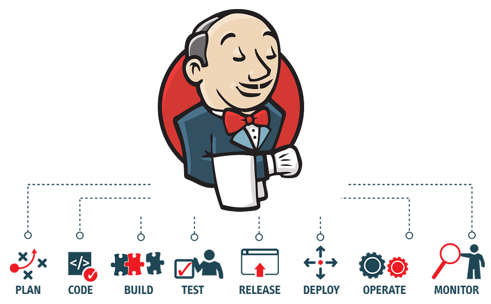
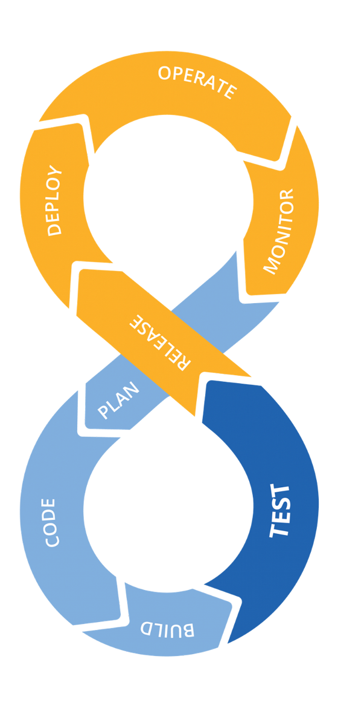
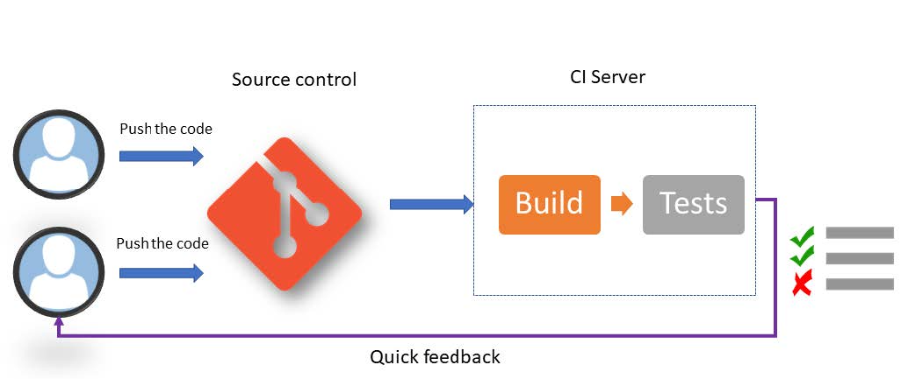
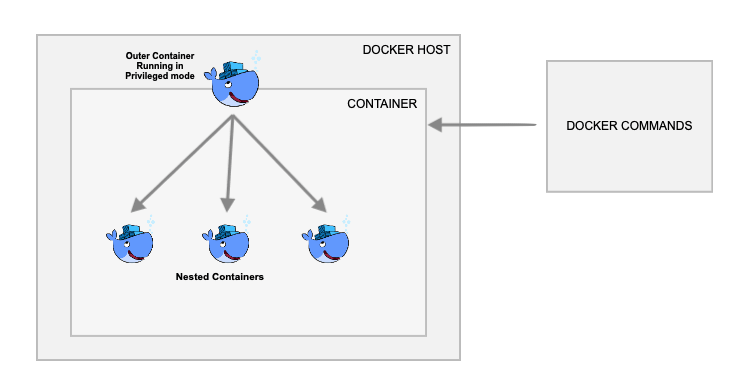
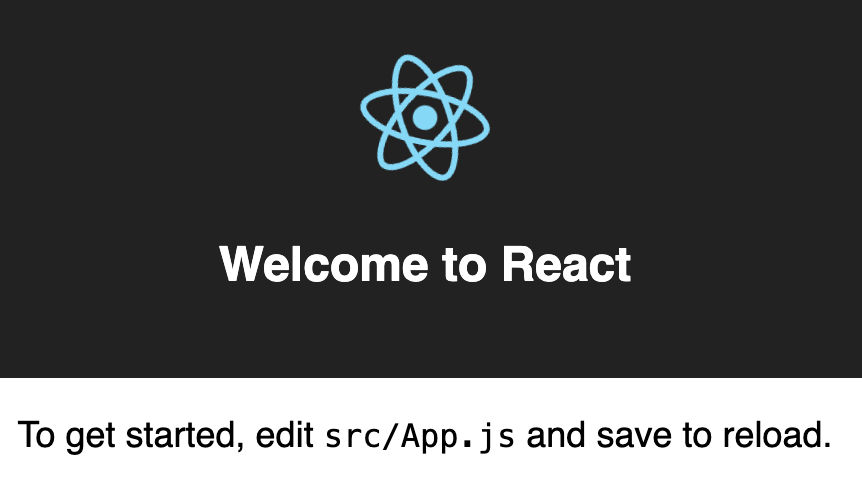

<!-- size: 16:9 -->
<!-- theme: default -->

<!-- paginate: skip -->
<!-- headingDivider: 1 -->

<style>
h1 {
  text-align: center;
  color: #005877;
}
h2 {
  color: #E87B00;
}
h3 {
  color: #005877;
}

img[alt~="center"] {
  display: block;
  margin: 0 auto;
}
img[alt~="float"] {
  display: float;
  margin: 8px 5px 0 5px;
}
emph {
  color: #E87B00;
}
</style>

# CI/CD con Jenkins

---



# Integración y Entrega Continuas

---

## Continous Integration / Continuous Delivery



- Continuous integration (CI)
- Continuous delivery (CD)
- Continuous deployment

Cada proceso tiene su propio <emph>pipeline</emph>

<!--

Cada uno de estos procesos tiene su propio pipeline

-->

---

### Pipeline de CI



<!--

CI es la práctica de construir y probar las aplicaciones en cada nueva versión.

-->

---

### Pipeline de CD


<!--

CD añade pruebas automáticas y despliegue automático al proceso de CI.

Gracias a CD, el software entregado debe funcionar siempre.

Todos los cambios que se incorporan en un _build_ pueden formar parte de un candidato a _release_.

Antiguamente, los cambios pequeños solían tener que esperar a que se completaran otros muchos antes de ser empaquetados en una release. Siguiendo ese modelo, se suponía que el software era incorrecto hasta que era validado por profesionales de QA. Todas las pruebas se realizaban después del desarrollo, la responsabilidad de la calidad recaía exclusivamente en el equipo de QA.

-->

---

### Continuous Deployment


<!--

El despliegue continuo es la práctica de desplegar automáticamente el software en producción después de cada cambio.

La entrega es manual, el despliegue es automático.

-->

---

| 📙 | Definiciones |
----:|:----
<emph>Build</emph>   | compilar y ensamblar el código fuente en formato ejecutable o en un conjunto de artefactos para un entorno específico
<emph>Pipeline</emph>   | conjunto automatizado y secuencial de procesos para ejecutar tareas específicas
<emph>Staging</emph> | entorno de prueba que replica el entorno de producción para realizar pruebas finales (con usuarios) antes del despliegue
<emph>Artefacto</emph> | resultado del _build_. Pueden ser binarios ejecutables, bibliotecas, paquetes de instalación, etc., necesarios para ejecutar la aplicación
<emph>Release</emph> | una versión específica y completa de una aplicación o software que se considera lista para ser distribuida y utilizada por los usuarios finales

---

# Jenkins


---

<!-- paginate: true -->

## ¿Qué es Jenkins?

- Jenkins es un servidor de automatización de código abierto escrito en Java.

- Ayuda a automatizar el proceso de compilación, prueba e implementación de software.

- Se puede instalar a través de paquetes nativos, Docker o incluso ejecutarlo como una aplicación independiente.

- Se puede integrar con una gran cantidad de herramientas de desarrollo y pruebas a través de complementos.

---

## Descargar e instalar Jenkins en Docker

- Hay varias imágenes de Docker de Jenkins disponibles.

- Utiliza la imagen oficial recomendada https://hub.docker.com/r/jenkins/jenkins/ del repositorio Docker Hub. Esta imagen contiene la versión actual LTS de Jenkin

- Sin embargo, esta imagen no contiene Docker CLI, ni incluye plugins de Blue Ocean que se utilizan con frecuencia

- Vamos a realizar una instalación personalizada

Como requisito previo, debes tener instalado Docker en su sistema

https://www.jenkins.io/doc/book/installing/docker/

---

### Imágenes de Docker

```bash
docker pull jenkins/jenkins
docker pull docker:dind
```

- La imagen dind (Docker in Docker) es una imagen de Docker que contiene Docker
- Dind se utiliza para ejecutar comandos de Docker dentro de los nodos de Jenkins

### Red

Crear una red de tipo bridge en Docker:

```bash
docker network create jenkins
```

---

## Docker in Docker (dind)



Crea un contenedor hijo dentro de otro contenedor Docker

- Contenedores e imágenes disponibles en el contenedor hijo
- Acceso [privilegiado](https://docs.docker.com/engine/reference/run/#runtime-privilege-and-linux-capabilities) al host (¡seguridad!)

---

### Instalación dind:

```bash
docker run --privileged -d --name dind-test docker:dind
docker exec -it dind-test /bin/sh
docker pull ubuntu
docker images
mkdir test && cd test
vi Dockerfile
docker build -t test-image .
```

<emph>Dockerfile</emph>:

```Dockerfile
FROM ubuntu:18.04
RUN apt-get update && \
    apt-get -qy full-upgrade && \
    apt-get install -qy curl && \
    apt-get install -qy curl && \
    curl -sSL https://get.docker.com/ | sh
```

---

### Docker in Docker (macOS y Linux) (comando)

Para ejecutar comandos de Docker dentro de los nodos de Jenkins, ejecuta la imagen de Docker `docker:dind` utilizando el siguiente comando:

```bash
docker run --name jenkins-docker --rm --detach \
  --privileged --network jenkins --network-alias docker \
  --env DOCKER_TLS_CERTDIR=/certs \
  --volume jenkins-docker-certs:/certs/client \
  --volume jenkins-data:/var/jenkins_home \
  --publish 2376:2376 \
  docker:dind --storage-driver overlay2
```

---

### Docker in Docker (Windows) (comando)

En Windows, ejecuta el siguiente comando para ejecutar la imagen de Docker `docker:dind`:

```bash
docker run --name jenkins-docker --rm --detach ^
  --privileged --network jenkins --network-alias docker ^
  --env DOCKER_TLS_CERTDIR=/certs ^
  --volume jenkins-docker-certs:/certs/client ^
  --volume jenkins-data:/var/jenkins_home ^
  --publish 2376:2376 ^
  docker:dind
```

---

### Docker in Docker

```bash
docker run --name jenkins-docker # Nombre del contenedor
  --rm # Elimina el contenedor cuando se para
  -d # Ejecuta el contenedor en segundo plano
  --privileged # Otorga privilegios necesarios para Dind
  --network jenkins # Conecta el contenedor a la red jenkins
  --network-alias docker 
  # Contenedor de Dind disponible como el nombre de host 'docker'
  --env DOCKER_TLS_CERTDIR=/certs # Habilita TLS dentro del contenedor
  -v jenkins-docker-certs:/certs/client # Certificados TLS
  -v jenkins-data:/var/jenkins_home # Datos de Jenkins
  -p 2376:2376 # Puertos
  docker:dind # Imagen de Docker
  --storage-driver overlay2 # Controlador de almacenamiento a utilizar
```

---

### Dockerfile

Personaliza la imagen oficial de Jenkins de Docker usando un Dockerfile:

```bash
FROM jenkins/jenkins
USER root
RUN apt-get update && apt-get install -y lsb-release
RUN curl -fsSLo /usr/share/keyrings/docker-archive-keyring.asc \
  https://download.docker.com/linux/debian/gpg
RUN echo "deb [arch=$(dpkg --print-architecture) \
  signed-by=/usr/share/keyrings/docker-archive-keyring.asc] \
  https://download.docker.com/linux/debian \
  $(lsb_release -cs) stable" > /etc/apt/sources.list.d/docker.list
RUN apt-get update && apt-get install -y docker-ce-cli
USER jenkins
RUN jenkins-plugin-cli --plugins "blueocean docker-workflow"
```

---

### Construir imagen

Construye una nueva imagen de Docker a partir de este Dockerfile y asigna a la imagen un nombre significativo como `myjenkins-blueocean`:

```bash
docker build -t myjenkins-blueocean .
```

---

## Ejecutar Jenkins

Ejecuta la imagen de Jenkins personalizada con el siguiente comando:

```bash
docker run --name jenkins-blueocean --restart=on-failure --detach \
  --network jenkins --env DOCKER_HOST=tcp://docker:2376 \
  --env DOCKER_CERT_PATH=/certs/client --env DOCKER_TLS_VERIFY=1 \
  --publish 8080:8080 --publish 50000:50000 \
  --volume jenkins-data:/var/jenkins_home \
  --volume jenkins-docker-certs:/certs/client:ro \
  myjenkins-blueocean
```

Opcionalmente, puede añadirse `--env JAVA_OPTS="-Dorg.jenkinsci.plugins.durabletask.BourneShellScript.LAUNCH_DIAGNOSTICS=true" \` justo antes de la última línea para que Jenkins muestre los logs de los scripts.

---

### Ejecutar Jenkins (explicación)

```bash
docker run 
  --name jenkins-blueocean # Nombre del contenedor
  --restart=on-failure # Reinicia el contenedor si falla
  -d # Ejecuta el contenedor en segundo plano
  --network jenkins # Conecta el contenedor a la red jenkins
  --env DOCKER_HOST=tcp://docker:2376 # Dirección del host de Docker
  --env DOCKER_CERT_PATH=/certs/client # Ruta certificados TLS
  --env DOCKER_TLS_VERIFY=1 # Habilita verificación de TLS
  -p 8080:8080 -p 50000:50000 # Puertos
  -v jenkins-data:/var/jenkins_home # Datos de Jenkins
  -v jenkins-docker-certs:/certs/client:ro # Certificados TLS
  myjenkins-blueocean # Especifica la imagen de Docker a utilizar
```

---

## Accediendo al contenedor de Docker

Para acceder al contenedor de Docker, usa `docker exec` junto con el nombre del contenedor de Docker y `bash`:

```bash
docker exec -it jenkins-blueocean bash
```

Para acceder a los logs del contenedor de Docker, usa `docker logs`:

```bash
docker logs jenkins-blueocean
```

En caso de haber usado otro nombre para el contenedor, sustituye `jenkins-blueocean` por el nombre que hayas usado.

---

## Asistente de configuración

Después de instalar y ejecutar Jenkins podemos a un asistente de configuración a través de la interfaz web:

http://localhost:8080

Este asistente te guía para:
  - Desbloquear Jenkins
  - Instalar plugins
  - Crear el primer usuario administrador

---

## Crear un Pipeline (I)

Un pipeline es un conjunto de pasos que Jenkins ejecuta para compilar, probar y entregar software.

Un pipeline se define en un archivo de texto llamado `Jenkinsfile`.

1. Haz clic en **Nueva tarea** en el menú de la izquierda

2. Introduce un nombre para la tarea y selecciona **Pipeline**

3. Haz clic en **OK**

---

## Crear un Pipeline (II)

1. En la sección **Definición de Pipeline**, selecciona **Pipeline script**

2. Introduce el siguiente código en el editor:

```groovy
  pipeline { // Declaración de pipeline
      agent any // Agente que ejecuta el pipeline
      stages { // Declaración de etapas
          stage('Stage 1') { // Declaración de etapa
              steps { // Declaración de pasos
                  echo 'Hello world!' // Paso
              }
          }
      }
  }
```

3. Haz clic en **Guardar**

---

## Ejecutar un Pipeline

1. Haz clic en **Construir ahora** en el menú de la izquierda

2. Haz clic en el número de compilación en la columna **Construcciones**

3. En la sección, **Console Output**, podemos ver la salida del pipeline

Debido a que personalizamos la imagen de Jenkins, también podemos usar la interfaz **Open Blue Ocean** (menú de la izquierda).

---

## Jenkinsfile

- Contiene la definición de un pipeline
- Está escrito en el lenguaje de programación Groovy
- Se puede almacenar en un repositorio de código fuente como GitHub y Bitbucket

```groovy
pipeline {
    agent {
        // Agente que ejecuta el pipeline (puede ser de Jenkins o de Docker)
    }
    environment {
        // Variables de entorno
    }
    stages {
        // Declaración de etapas
    }
}
```

---

### Agentes (Jenkins)

```groovy
pipeline {
    agent {
        label 'label' // Nombre del agente de Jenkins
    }
}
```

Podemos ver los agentes de Jenkins disponibles en **Administrar Jenkins** > **Administrar nodos**.

También podemos indicar que el pipeline se ejecute en cualquier agente disponible:

```groovy
pipeline {
    agent any
}
```

---

### Agentes (Docker)

```groovy
pipeline {
    agent {
        docker {
            image 'image'
            args 'args'
        }
    }
}
```

- `image` es el nombre de la imagen de Docker.
- `args` son los argumentos que se pasan a la imagen de Docker.

También se puede usar un archivo Dockerfile que se encuentre en el repositorio:

```groovy
pipeline {
    agent { dockerfile true }
}
```

---

### Variables de entorno

Las variables de entorno se definen de la siguiente manera:

```groovy

pipeline {
    environment {
        key = 'value'
    }
}
```

- `key` es el nombre de la variable de entorno
- `value` es el valor de la variable de entorno

---

### Etapas

```groovy
pipeline {
    stages {
        stage('Stage 1') {
            steps {
                // Pasos de la etapa
            }
        }
    }
}
```

- Una etapa es una colección de pasos
  - Las etapas se ejecutan secuencialmente
  - Aunque hay opciones para ejecutarlas en paralelo
- Un paso es una acción que se ejecuta en un agente
  - Los pasos se ejecutan secuencialmente
  - Se usa `sh` para ejecutar comandos de shell

---

## Pipeline from SCM

Escribir y mantener pipelines complejas dentro del área de texto del Script en la página de configuración de la Pipeline en la interfaz clásica de Jenkins puede ser complicado.

La alternativa para facilitar este proceso es escribir tu Jenkinsfile en un IDE y luego subirlo al control de código fuente.

---

### Crear Pipeline from SCM

1. Crea una nueva pipeline y selecciona **Pipeline script from SCM** en la sección **Definición de Pipeline**
2. En **SCM**, selecciona **Git**
3. En **Repository URL**, introduce la URL del repo y las credenciales:

   - **Kind**: Username with password
   - **Username**: nombre de usuario del repositorio
   - **Password**: Token de Acceso Personal (PAT)
   - **ID**: Nombre de la credencial

4. En **Script Path**, introduce el path del archivo Jenkinsfile
5. Haz clic en **Guardar**

---

## Pipeline para desplegar aplicación React

Vamos a crear un pipeline para desplegar una aplicación React en un contenedor Docker:
https://www.jenkins.io/doc/tutorials/build-a-node-js-and-react-app-with-npm/

Como requisito previo, debes publicar dos puertos adicionales en el contenedor Dind para Jenkins (jenkins-docker):

`--publish 3000:3000 --publish 5000:5000`

---

### Ejemplo: Pipeline para desplegar aplicación React (I)

1. Crear fork del repositorio que contiene la aplicación: https://github.com/jenkins-docs/simple-node-js-react-npm-app
2. Clonamos el repositorio en nuestro equipo
3. Creamos un archivo `Jenkinsfile` en el directorio raíz del repositorio
4. Creamos un pipeline en Jenkins con la opción **Pipeline script from SCM** y la siguiente configuración:
   - **SCM**: Git
   - **Repository URL**: URL del repositorio
   - **Credentials**: No indicar credenciales (el repositorio será público)
   - **Script Path**: Jenkinsfile
   - **Branches to build**: */master

---

### Ejemplo: Pipeline para desplegar aplicación React (II)

Incluimos el siguiente código en el archivo `Jenkinsfile` y lo subimos al repositorio.

```groovy
pipeline {
    agent {
        docker {
            image 'node:20.10.0-alpine3.18' // Imagen de Docker
            args '-p 3000:3000' // Puertos
        }
    }
    stages {
        stage('Build') { 
            steps {
                sh 'npm install' // Instalar dependencias
            }
        }
    }
}
```

---

### Ejemplo: Pipeline para desplegar aplicación React (III)

Volvamos a Jenkins y ejecutemos el pipeline.

1. Haz clic en **Construir ahora** en el menú de la izquierda
2. Puedes ver el progreso del pipeline en la interfaz de usuario de Jenkins

Es posible que debas esperar varios minutos para que se complete esta primera ejecución

Después de clonar tu repositorio local, `Jenkins`:

- Coloca el proyecto en la cola para ejecutarse en el agente
- Descarga la imagen Docker de Node y la ejecuta en un contenedor

Una vez finalizada la ejecución, podemos ver el resultado en la interfaz de Jenkins.

---

### Ejemplo: Pipeline para desplegar aplicación React (IV)

Actualizamos el archivo `Jenkinsfile`:

```groovy
  stage('Test') { 
      steps {
          sh './jenkins/scripts/test.sh' 
      }
  }
```

- El Pipeline debe quedar lo más ordenado posible
- Los pasos de scripting de construcción más complejos se pueden colocar en archivos separados
- Esto facilita el mantenimiento del Pipeline, especialmente si adquiere más complejidad

Podemos volver a Jenkins y ejecutar el pipeline.

---

### Ejemplo: Pipeline para desplegar aplicación React (V)

Actualizamos el archivo `Jenkinsfile` con una etapa de Despliegue:

```groovy
  stage('Deploy') {
      steps {
          sh './jenkins/scripts/deploy.sh'
          input message: 'Finished using the web site? (Click "Proceed" to continue)'
          sh './jenkins/scripts/kill.sh'
      }
  }
```

- El script `deploy.sh` despliega la aplicación en un contenedor Docker (más detalles dentro del script)
- `input message` detiene la ejecución y solicita respuesta al usuario

---

### Ejemplo: Pipeline para desplegar aplicación React (VI)

Finalmente, volvemos a ejecutar el pipeline y vemos el resultado en la interfaz de Jenkins.

Si accedemos a http://localhost:3000, podemos ver la aplicación React desplegada:



- Si accedemos al contenedor de Jenkins, podemos ver los archivos generados por el pipeline en el directorio `/var/jenkins_home/workspace/<nombre-del-pipeline>`
- Además, con el comando `docker ps` podemos ver el contenedor creado durante la ejecución del pipeline
