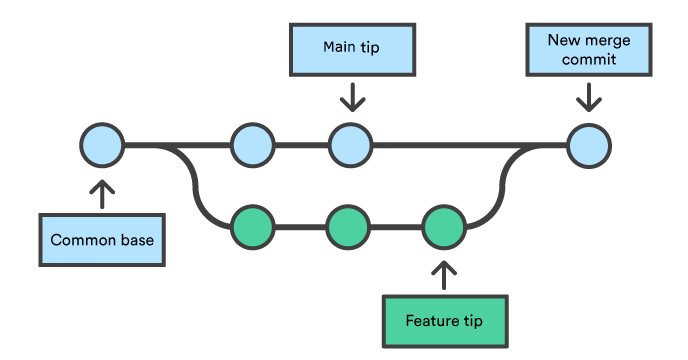

<!-- size: 16:9 -->
<!-- theme: default -->

<!-- paginate: skip -->
<!-- headingDivider: 1 -->

<style>
h1 {
  text-align: center;
  color: #005877;
}
h2 {
  color: #E87B00;
}
h3 {
  color: #005877;
}

img[alt~="center"] {
  display: block;
  margin: 0 auto;
}
img[alt~="float"] {
  display: float;
  margin: 8px 5px 0 5px;
}
</style>

# Sistema de Control de Versiones (SCV)


---

<!-- paginate: true -->

## SCV

### ¿Qué es un Sistema de Control de Versiones (SCV)?

Un SCV, en inglés *version control system* (VCS), es un sistema que registra los cambios realizados en un conjunto de archivos a lo largo del tiempo.

Permite recuperar versiones específicas de esos archivos, lo que es útil para el trabajo colaborativo y para mantener un historial de cambios.

### Repositorio

Un repositorio es un lugar donde se almacenan los archivos de un proyecto, junto con el historial de cambios.

Puede estar ubicado localmente en la máquina del usuario o de forma remota en un servidor.

---

## Herramientas SCV

- **Subversion (SVN)**: sistema centralizado de control de versiones
  - Un solo repositorio central que almacena todas las versiones
  - Los usuarios deben estar conectados al repositorio central para trabajar

- **Git**: sistema distribuido de control de versiones
  - Cada usuario tiene una copia completa del repositorio
  - Los usuarios pueden trabajar de forma independiente sin necesidad de una conexión constante a un servidor central

Git fue creado por Linus Torvalds en 2005 y se ha convertido en uno de los SCV más populares y ampliamente utilizados en la comunidad de desarrollo de software.

---

## Repositorios en la Nube

Existen plataformas de alojamiento de repositorios en la nube como GitHub, GitLab y Bitbucket.

Estas plataformas permiten a los desarrolladores alojar y colaborar en proyectos de código abierto y privados de forma remota.


  

---

## Instalación de Git

### Linux

```bash
sudo apt update
sudo apt install git
```

### Windows

Descarga e instala Git desde el sitio web oficial [Git Download](https://git-scm.com/downloads)

### Mac

Descarga e instala Git desde el sitio web oficial [Git for Mac](https://git-scm.com/download/mac) o usando brew:

```bash
brew install git
```

---

## Comandos básicos de Git

### Inicializar un repositorio local

En caso de que no exista un repositorio local, podemos crear uno con:

```bash
git init
```

- Se creará un nuevo repositorio de Git en ese directorio
- Se crea un directorio oculto llamado `.git` que contiene todos los archivos necesarios para el repositorio

Sin embargo, en la mayoría de los casos, clonaremos un repositorio remoto.

---

### Clonar un repositorio remoto

Al clonar un repositorio remoto, se crea una copia del repositorio en nuestro equipo que debemos sincronizar manualmente.

```bash
git clone <repo>
```

Los repositorios tendrán sus propios permisos de lectura y escritura.

Si son privados, necesitareis autenticaros para poder clonarlos.

Vamos a usar un repositorio público de Github:
  
```bash
  git clone https://github.com/jacaballero/vs-git-<curso_actual>.git
```

Donde `<curso_actual>` es el curso actual (por ejemplo, `23-24`).

---

### Actualizar un repositorio local

Creamos un archivo de texto usando nuestro identificador UCA como nombre `uxxxxxxxx.txt`.

Para agregar el archivo al repositorio local, usamos el comando `git add`:

```bash
git add <file>
```

Podemos añadir todos los archivos y directorios nuevos o modificados con:

```bash
git add .
```

Podemos comprobar el estado del repositorio local usando el comando `git status`:

- Archivos nuevos o modificados aparecerán en rojo
- Archivos añadidos al repositorio aparecerán en verde

---

### Actualizar repositorio

Para confirmar los cambios en el repositorio local, usamos el comando `git commit`:

```bash
git commit -m "Mensaje"
```

- El mensaje debe ser descriptivo y debe indicar los cambios realizados
- Al ejecutar `git commit`, se crea un nuevo commit en el repositorio local
- Cada commit tiene un identificador único que se puede usar para identificarlo

Para subir los cambios al repositorio remoto, usamos el comando `git push` (debemos tener permisos de escritura en el repositorio remoto):

```bash
git push
```

Si queremos actualizar nuestro repositorio local con los cambios del repositorio remoto:

```bash
git pull
```

---

### Comprobar cambios

Para ver las diferencias entre el repositorio local y el repositorio remoto:

```bash
git diff
git diff <file>
```

Para ver el historial de cambios realizados en el repositorio local:

```bash
git log
git log <file>
```

Para ver el historial de cambios realizados en el repositorio remoto:

```bash
git log origin/main
git log origin/main <file>
```

---

### Deshacer cambios

Para deshacer los cambios realizados en un archivo:

```bash
git checkout <file>
```

Para deshacer los cambios realizados en todos los archivos:

```bash
git checkout .
```

Si queremos deshacer los cambios realizados en un archivo que hemos añadido al repositorio:

```bash
git reset HEAD <file>
```

HEAD hace referencia al último commit realizado.

---

## Trabajando con ramas

Una rama es una línea de desarrollo independiente que permite trabajar en un conjunto de cambios sin afectar al resto del proyecto.

Las ramas se pueden fusionar entre sí para combinar los cambios realizados en cada una de ellas.


[Ejemplo de ramas en un repositorio de Git](https://www.atlassian.com/git/tutorials/using-branches)

---

### Uso de ramas (I)

Una rama se crea a partir de otra rama existente.


- `git branch` muestra las ramas existentes
- Podemos ver la rama actual con `git branch` y con `git status`.

Para crear una nueva rama a partir de la rama actual:

```bash
git branch <nombre_de_la_rama>
```

Para crear una nueva rama a partir de la rama actual y cambiar a ella:

```bash
git checkout -b <nombre_de_la_rama>
```

---

### Uso de ramas (II)

Cambiar de rama:

```bash
git checkout <nombre_de_la_rama>
```

Subir una rama al repositorio remoto:

```bash
git push origin <nombre_de_la_rama>
```

Eliminar una rama del repositorio local (seguirá existiendo en el repositorio remoto):

```bash
git branch -d <nombre_de_la_rama>
```

Eliminar una rama del repositorio remoto (seguirá existiendo en el repositorio local):

```bash
git push origin --delete <nombre_de_la_rama>
```

---

### Stash

Stash permite guardar los cambios realizados en la rama actual para poder cambiar de rama sin tener que hacer un commit.

Para guardar los cambios realizados en la rama actual:

```bash
git stash
```

Para recuperar los cambios guardados:

```bash
git stash pop
```

Para ver los cambios guardados:

```bash
git stash list
```

Para eliminar los cambios guardados:

```bash
git stash drop
```

---

### Fusionar ramas (I)

Siempre que se fusionan dos ramas, se crea en la rama actual un nuevo commit que contiene los cambios de ambas ramas:



[Ejemplo de fusión de ramas en un repositorio de Git](https://www.atlassian.com/es/git/tutorials/using-branches/git-merge)

---

### Fusionar ramas (II)

Para fusionar una rama con la rama actual:

```bash
git merge <nombre_de_la_rama>
```

- Si no hay conflictos, se fusionarán automáticamente
- Si hay conflictos, se mostrará un mensaje de error y habrá que resolverlos manualmente

Para resolver conflictos, se editan los archivos que los contienen y se añaden al repositorio con `git add`.

Una vez resueltos los conflictos, se puede fusionar la rama con la rama actual.

---

### Ejemplo de conflicto entre ramas

1. Crear una rama nueva llamada `prueba1` a partir de la rama actual y cambiar a ella
2. Editar el archivo `uxxxxxxxx.txt` y añadir una línea con el texto `prueba1`
3. Añadir el archivo al repositorio local y hacer un commit
4. Cambiar a la rama `main`
5. Editar el archivo `uxxxxxxxx.txt` y añadir una línea con el texto `main`
6. Añadir el archivo al repositorio local y hacer un commit
7. Fusionar la rama `prueba1` con la rama `main`


---

### Solucionar conflictos entre ramas

Podemos ver los conflictos con `git status`.

Para solucionar el conflicto, editamos el archivo `uxxxxxxxx.txt` y dejamos el contenido que queramos.

También podemos solucionar el conflicto aceptando el contenido de una de las ramas con:

```bash
git checkout --ours <file>
```

```bash
git checkout --theirs <file>
```

Donde `ours` es la rama actual y `theirs` es la rama que estamos fusionando.

---

### Rebase de ramas (I)

Rebase soluciona el mismo problema que la fusión de ramas, pero de forma muy distinta:

- La fusión de ramas crea un nuevo commit que contiene los cambios de ambas ramas
- El rebase mueve los commits de una rama a otra


[Ejemplo de rebase de ramas en un repositorio de Git](https://www.atlassian.com/es/git/tutorials/merging-vs-rebasing)

---

### Rebase de ramas (II)

Para hacer un rebase de una rama con la rama actual:

```bash
git rebase <nombre_de_la_rama>
```

1. Crear una rama llamada `feature_rebase` a partir de la rama actual y cambiar a ella
2. Crea un archivo `feature_rebase.txt`
3. Añadir el archivo al repositorio local y hacer un commit
4. Cambiar a la rama `main`
5. Añadir un archivo `main.txt`
6. Añadir el archivo al repositorio local y hacer un commit
7. Cambiar a la rama `feature_rebase`
8. Hacer un rebase de la rama `feature_rebase` con la rama `main`
9. Comprobar el historial de cambios con `git log`

---

### Rebase de ramas (III)

En resumen, rebase actualiza el historial de cambios de una rama con el historial de cambios de otra rama.

Es muy útil para mantener el historial de cambios de una rama "limpio" y ordenado.

**Suele usarse en ramas de desarrollo que se fusionan con la rama principal del proyecto.**

Rebase es una operación muy potente, pero también muy peligrosa:

- Si se hace mal, puede provocar que se pierdan commits
- Siempre que se haga un rebase, se debe hacer en una rama que no se haya compartido con nadie

---

## Archivos especiales de git

El archivo `.gitignore` permite ignorar archivos y directorios que no queremos añadir al repositorio.

- Los archivos y directorios que queremos ignorar se añaden al archivo `.gitignore`
- En caso de querer añadir una excepción a un archivo o directorio ignorado, se puede forzar su inclusión con `!` dentro del archivo `.gitignore`
- En caso de querer añadir un archivo o directorio ignorado, se puede forzar su inclusión con `git add -f`

El archivo `.gitkeep` permite añadir un directorio vacío al repositorio.
- Git no permite añadir directorios vacíos al repositorio
- Para añadir un directorio vacío, se crea un archivo `.gitkeep` dentro del directorio

---

## Herramientas para trabajar con Git

Algunas herramientas para trabajar con Git mediante una interfaz gráfica:

- [SourceTree](https://www.sourcetreeapp.com/)
- [Git for Windows](https://gitforwindows.org/)
- [GitHub Desktop](https://desktop.github.com/)
- [Git Extensions](https://gitextensions.github.io/)
- [TortoiseGit](https://tortoisegit.org/)

Los IDEs más populares también tienen integración con Git.

---

## Tarea

1. Crear un repositorio en GitHub
2. Clonar el repositorio en local
3. Añadir cambios a la rama `main` añadiendo un directorio vacío y un archivo .gitignore para ignorar todos los archivos markdown excepto el README.md y el LICENSE.md
4. Crea una rama `feature` y añade cambios a esa rama
5. Crear dos ramas desde main, añadir cambios, fusionarlas en main y eliminarlas. Una de las ramas debe contener conflictos a resolver
6. Hacer rebase de la rama `feature` con la rama `main`
7. Añadir un cambio más a la rama `feature`
8. Fusionar la rama `feature` con la rama `main`
9. Subir los cambios al repositorio remoto
10. Eliminar la rama `feature`
