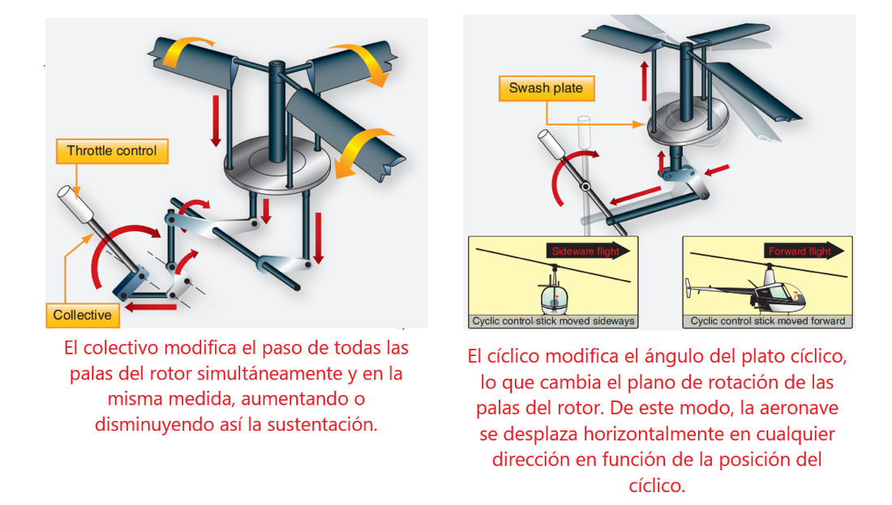

<!-- size: 16:9 -->
<!-- theme: default -->

<!-- paginate: false -->

<style>
h1 {
  text-align: center;
}
h2 {
  color: darkblue;
  text-align: center;
}
</style>

# ORTOGONALIDAD

---

<!-- paginate: true -->

<style scoped>
p {
  text-align: center;
}
</style>


## Ortogonalidad

Dos componentes A y B son ortogonales ($A \perp B$) si los cambios en uno no afectan al otro. Suponen más independencia y menos acoplamiento. Por ejemplo:

### Ejemplos

- La base de datos debe ser ortogonal a la interfaz de usuario
- En un helicóptero, los mandos de control no suelen ser ortogonales

---



---

>    Helicopters have four basic controls. The cyclic is the stick you hold in your right hand. Move it, and the helicopter moves in the corresponding direction. Your left hand holds the collective pitch lever. Pull up on this and you increase the pitch on all the blades, generating lift. At the end of the pitch lever is the throttle. Finally you have two foot pedals, which vary the amount of tail rotor thrust and so help turn the helicopter.
>
>    However, when you try it, you discover that life isn’t that simple. The helicopter’s nose drops, and you start to spiral down to the left. Suddenly you discover that you’re flying a system where every control input has secondary effects. Lower the left-hand lever and you need to add compensating backward movement to the right-hand stick and push the right pedal. But then each of these changes affects all of the other controls again. Suddenly you’re juggling an unbelievably complex system, where every change impacts all the other inputs. Your workload is phenomenal: your hands and feet are constantly moving, trying to balance all the interacting forces.
> -- ([Hunt, 2020](bibliografia.md#pragmatic2))

---

## Beneficios de la ortogonalidad

### Mayor productividad

- Es más fácil escribir un componente pequeño y auto-contenido que un bloque muy grande de código. El tiempo de desarrollo y __pruebas__ se reduce
- Se pueden combinar unos componentes con otros más fácilmente. Mayor __reutilización__.
- En teoría, si $A \perp B$, el componente A sirve para $m$ propósitos y B sirve para $n$, entonces $A \cup B$ sirve para $m \times n$ propósitos.
- La falta de cohesión perjudica la reutilización ⟶  ¿y si hay que hacer una nueva versión gráfica de una aplicación de línea de comandos que lleva incrustada la escritura en consola con `System.out.println`? Pueden descohesionar!

---

### Menor riesgo

- Defectos aislados, más fáciles de arreglar
- Menor __fragilidad__ del sistema global. Los problemas provocados por cambios en un área se limitan a ese área
- Más fácil de __probar__, pues será más fácil construir pruebas individuales de cada uno de sus componentes (por ejemplo, las técnicas de _[mocking](https://en.wikipedia.org/wiki/Mock_object)_ son más sencillas)

---

## Niveles de aplicación de la ortogonalizad

La ortogonalidad es aplicable a:

- el diseño
- la codificación
- las pruebas
- bibliotecas
- la documentación

A nivel de _diseño_, los patrones de diseño y las arquitecturas como MVC facilitan la construcción de componentes ortogonales.


### Lectura recomendada
  - Leer el [Topic 10: Orthogonality](https://learning-oreilly-com.bibezproxy.uca.es/library/view/the-pragmatic-programmer/9780135956977/f_0028.xhtml#orthogonality) de ([Hunt, 2020](bibliografia.md#pragmatic2))

---

## Técnicas de codificación

Técnicas de codificación para fomentar la ortogonalidad:

- Hacer **refactoring**
- Codificar **patrones** de diseño: strategy, template method, etc.
- Evitar datos globales y __singletons__: ¿qué pasaría si hubiera que hacer una versión *multithreaded* de una aplicación?
- **Inyectar**: pasar explícitamente el contexto (dependencia) como parámetro a los constructores
- Usar **anotaciones** (Java), decoradores (TypeScript) o atributos (C#)
- **Desacoplar**: Ley de *Demeter* — «No hables con extraños»
- Usar programación orientada a **aspectos**

---

## Desacoplar - ley de Demeter

Al pedir un servicio a un objeto, el servicio debe ser realizado de parte nuestra, no que nos devuelva un tercero con el que tratar para realizarlo

### Ejemplo

```java
  public boolean canWrite(User user) {
    if (user.isAnonymous())
      return false;
    else {
      return user.getGroup().hasPermission(Permission.WRITE);
    }
  }
```

---

__Refactorización__: definir un método `User.hasPermission()`

### Lectura recomendada
  - Leer el [Topic 28: Decoupling](https://learning-oreilly-com.bibezproxy.uca.es/library/view/the-pragmatic-programmer/9780135956977/f_0049.xhtml#coupling) de ([Hunt, 2020](bibliografia.md#pragmatic2)).


---

### Ley de Demeter para funciones

Los métodos de un objeto solo deben hacer llamadas a métodos...

1. __propios__ 
2. de objetos pasados como __parámetros__
3. de objetos __creados__ por ellos mismos
1. de objetos __declarados__ en el mismo método

---

```java
class Demeter {
  private A a;
  private int func();
  public void example (B b);

  void example(B b) {
    C c;
    int f = func();  // (caso 1)
    b.invert();      // (caso 2)
    a = new A();
    a.setActive();   // (caso 3)
    c.print();       // (caso 4)
}
```

---

#### Excepción: Interfaces _fluent_

Hay una excepción notable a la prohibición de encadenar llamadas a funciones de la ley de Demeter. Esta regla no aplica si es muy poco probable que haya cambios en las cosas que se encadenan. En la práctica, cualquier parte de tu aplicación debe considerarse como algo que es probable que cambie; cualquier elemento de una biblioteca de un tercero debe considerarse volátil, en particular si quienes mantienen dicha biblioteca suelen cambiar su API de una versión a otra.

Las librerías que vienen con el lenguaje suelen ser bastante estables, así que ejemplos de código como el siguiente son aceptables como excepción a esta interpretación de la ley de Demeter:

---

```java
List<String> myList =
    Arrays.asList("a1", "a2", "b1", "c2", "c1");

myList
    .stream()
    .filter(s -> s.startsWith("c"))
    .map(String::toUpperCase)
    .sorted()
    .forEach(System.out::println);
```

---

Los métodos `stream`, `filter`, `map`, `sorted` y `forEach` son parte de las nuevas _interfaces funcionales_ de Java para manejar _streams_, incorporadas a las colecciones (v.g. `List`) desde la versión Java 8.

Este tipo de interfaces como la del API de streams de Java se conoce como [_fluent interfaces_](https://en.wikipedia.org/wiki/Fluent_interface).

> La programación con streams se tratará en el capítulo sobre [Programación basada en Eventos](eventos.md)

> Las interfaces funcionales se tratarán en el capítulo sobre [Programación Funcional](lambdas.md)

---

#### Críticas a la ley de Demeter

 La ley de Demeter, ¿realmente ayuda a crear código más mantenible?

##### Ejemplo: pintar gráficos de grabadoras

- Pintar un gráfico con los datos registrados por una serie de grabadoras (`Recorder`) dispersas por el mundo.
- Cada grabadora está en una ubicación (`Location`), que tiene una zona horaria (`TimeZone`).
- Los usuarios seleccionan (`Selection`) una grabadora y pintan sus datos etiquetados con la zona horaria correcta...

  ```java
  public void plotDate(Date aDate, Selection aSelection) {
    TimeZone tz = aSelection.getRecorder().getLocation().getZone();
  }
  ```

---

##### Críticas

- Multiplicidad de dependencias: `plotDate` ⟶ `Selection`, `Recorder`, `Location`, `TimeZone`.
- Si cambia la implementación de `Location` de forma que ya no incluye directamente una `TimeZone`, hay que cambiar `plotDate`
- Añadir un método *delegado* `getTimeZone` a `Selection`. Así `plotDate` no se entera de si la `TimeZone` le llega desde `Recorder` o desde un objeto contenido en `Recorder`.

---

  ```java
  public void plotDate(Date aDate, TimeZone tz) {
    /* ... */
  }
  plotDate(someDate, someSelection.getTimeZone());
  ```

  Ahora `plotDate` ⟶ `Selection`, `TimeZone`, pero se han eliminado las restantes dependencias.

- Costes de espacio y ejecución de métodos *wrapper* que reenvían la petición al objeto delegado: violar la ley de Demeter para mejorar el __rendimiento__
- Otros ejemplos de mejora del rendimiento: desnormalización de BBDD

---

## Ortogonalidad en toolkits y bibliotecas

Muchas bibliotecas actuales implementan la ortogonalidad a través de metadatos, o atributos o etiquetas (`@tag`), también llamados __anotaciones__ en Java y __decoradores__ en TypeScript.

Los metadatos se emplean para proporcionar propósitos específicos, como v.g. persistencia de objetos, transacciones, etc. Por ejemplo, Spring o EJB utilizan anotaciones @ declarativas para expresar la transaccionalidad de una operación o la persistencia de una propiedad de una clase fuera del método que debe ejecutar dichas funcionalidades.

Otro método para implementar la ortogonalidad es usar [Aspectos](aspectos.md) y _Aspect-Oriented Programming_ (AOP). Este método es empleado por el framework Spring.

